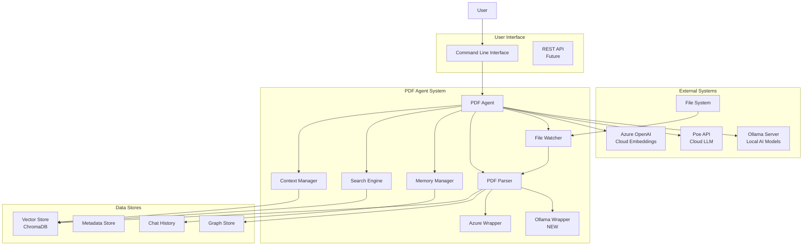
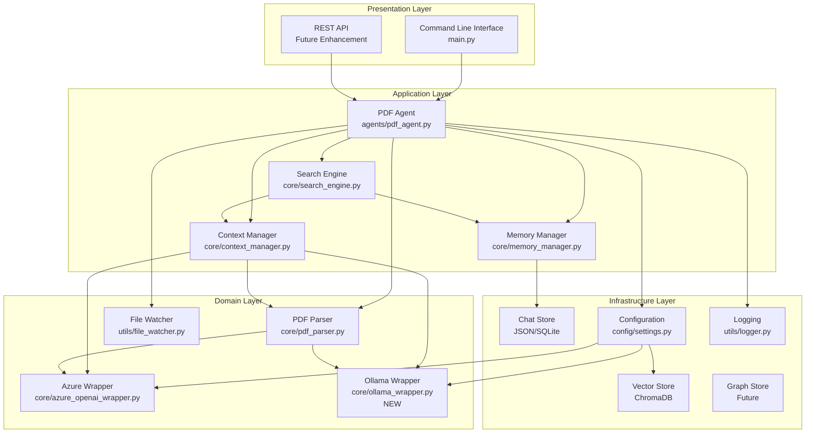
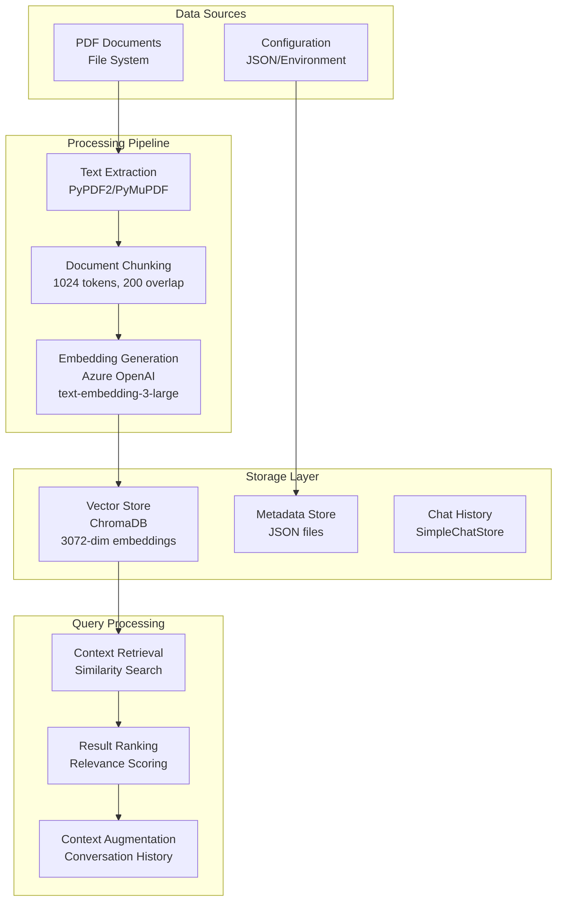
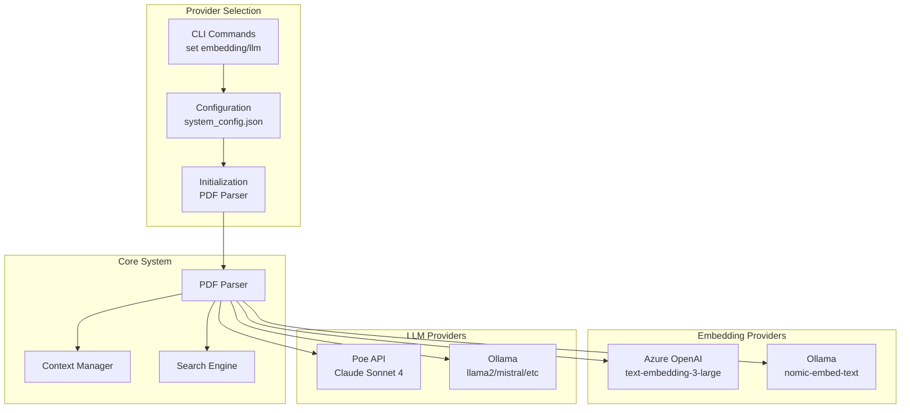
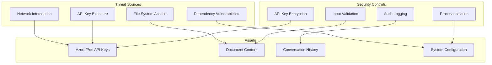
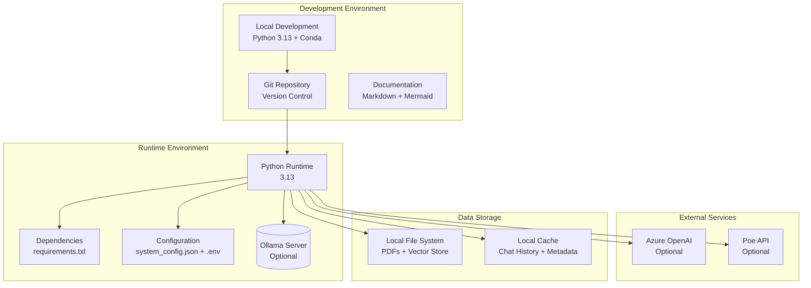
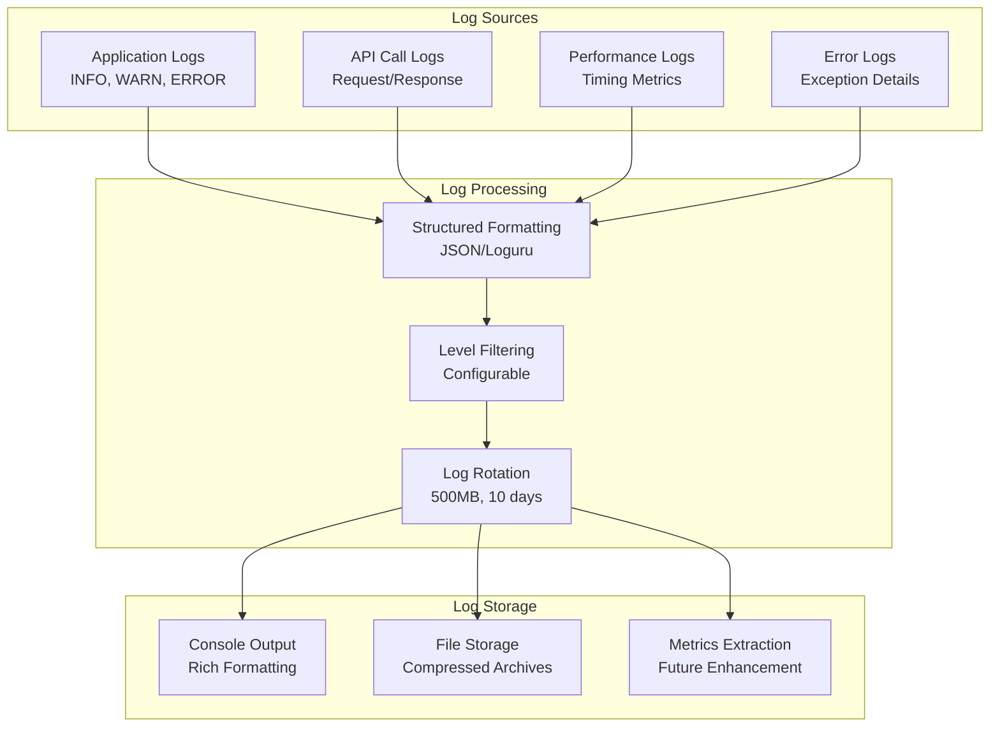

# PDF Agent System Architecture

## Document Information

- **Version**: 2.2
- **Date**: October 27, 2025
- **Author**: Senior Software Architect
- **System**: PDF Research Assistant Agent
- **Technology Stack**: Python 3.13, Azure OpenAI, Ollama, ChromaDB, LlamaIndex

## Table of Contents

1. [Executive Summary](#executive-summary)
2. [System Overview](#system-overview)
3. [Architecture Principles](#architecture-principles)
4. [System Context](#system-context)
5. [Component Architecture](#component-architecture)
6. [Provider Selection Architecture](#provider-selection-architecture)
7. [Data Architecture](#data-architecture)
8. [Technology Stack](#technology-stack)
9. [Key Components](#key-components)
10. [Security Architecture](#security-architecture)
11. [Performance Characteristics](#performance-characteristics)
12. [Deployment Architecture](#deployment-architecture)
13. [Monitoring and Observability](#monitoring-and-observability)
14. [Risks and Mitigations](#risks-and-mitigations)
15. [Future Roadmap](#future-roadmap)

## Executive Summary

The PDF Agent is an intelligent research assistant that leverages advanced AI technologies to provide comprehensive analysis and search capabilities across PDF document collections. The system combines vector embeddings, large language models, and sophisticated retrieval mechanisms to deliver context-aware responses and comprehensive document analysis.

### Key Capabilities

- **Intelligent Document Processing**: Automated PDF parsing, chunking, and indexing with vector embeddings
- **Multi-Modal Search**: Enhanced search with conversation context and comprehensive analysis modes
- **Memory Management**: Persistent conversation history and context awareness
- **Auto-Indexing**: Real-time monitoring and processing of new documents
- **Multi-Provider AI Support**: Flexible selection between cloud (Azure/Poe) and local (Ollama) AI providers
- **Scalable Architecture**: Modular design supporting multiple vector stores and LLM providers

### Business Value

- Reduces research time by 80% through intelligent document synthesis
- Provides comprehensive analysis across entire document collections
- Maintains conversation context for natural, iterative research workflows
- Supports both targeted queries and broad exploratory analysis

## Recent updates (2025-10-27)

This document has been updated to capture the latest code and architecture changes. Highlights:

- LlamaIndex migration and API compatibility: migrated from ServiceContext to the newer Settings-based configuration and updated code across the codebase to be compatible with LlamaIndex 0.14+ (see `core/pdf_parser.py`, `core/search_engine.py`).
- Azure OpenAI & Poe integration: introduced `core/azure_openai_wrapper.py` which centralizes Azure embedding calls and adds Poe LLM support for cloud completions. Endpoint/config handling and batching were fixed for robust embedding generation.
- Ollama local provider stabilized: added and improved `core/ollama_wrapper.py` to support local embeddings and local LLM completions for privacy/offline usage.
- Memory/ChatMessage fixes: resolved ChatMessage attribute handling and memory storage issues to ensure robust conversation history handling (`core/memory_manager.py`, `core/search_engine.py`).
- Retrieval behavior improvements: increased default retrieval `top_k` and lowered similarity cutoff to improve coverage; removed duplicate retrieval calls and improved prompt engineering for comprehensive analysis (`config/settings.py`, `core/context_manager.py`).
- Knowledge Graph integration: added `core/graph_manager.py` and `build_knowledge_graph.py` to extract entities/relations, persist a graph store, and enable hybrid vector+graph retrieval. See `documentation/KNOWLEDGE_GRAPH_GUIDE.md` for usage and details.
- Dependency and environment updates: updated `requirements.txt` and config loading for Python 3.13 compatibility and improved installability.

Verification notes & quick checks:

1. Confirm providers: check `system_config.json` and environment variables for Azure/Poe/Ollama settings.
2. Run an interactive search (via `python3 main.py`) and confirm responses cite multiple source files.
3. Optionally run `python3 build_knowledge_graph.py` to (re)build the knowledge graph; this may take significant time for large corpora.


## System Overview

The PDF Agent operates as a multi-layered AI system designed for research document analysis. It integrates document processing, vector embeddings, conversational AI, and persistent storage to create a seamless research experience.

### Core Workflows

1. **Document Ingestion**: PDF files are parsed, chunked, and indexed with vector embeddings
2. **Query Processing**: User queries are enhanced with conversation context and processed through retrieval-augmented generation
3. **Response Generation**: LLM generates contextually relevant responses with source citations
4. **Memory Management**: Conversation history is maintained for contextual continuity

### Architecture Characteristics

- **Modular Design**: Loosely coupled components with clear interfaces
- **Multi-Provider AI**: Support for both cloud and local AI providers (Azure/Poe vs Ollama)
- **Scalable Processing**: Batch processing for large document collections
- **Fault Tolerance**: Comprehensive error handling and retry mechanisms
- **Configurable**: Environment-based configuration with multiple deployment options

## Architecture Principles

### Design Principles

1. **Separation of Concerns**: Clear boundaries between document processing, search, and response generation
2. **Single Responsibility**: Each component has a focused, well-defined purpose
3. **Dependency Injection**: Loose coupling through configuration-driven component initialization
4. **Fail-Fast Design**: Early validation and graceful degradation

### Quality Attributes

- **Reliability**: Comprehensive error handling and recovery mechanisms
- **Performance**: Optimized for both real-time queries and batch processing
- **Maintainability**: Clean code structure with comprehensive documentation
- **Extensibility**: Plugin architecture for new LLM providers and vector stores

### Technical Principles

- **API-First Design**: RESTful interfaces for all major components
- **Configuration as Code**: Environment-driven configuration management
- **Observability**: Comprehensive logging and monitoring capabilities
- **Security by Design**: Secure credential management and access controls

## System Context



### External Interfaces

- **Azure OpenAI**: Cloud-based embedding generation (optional)
- **Poe API**: Hosted LLM service for response generation (optional)
- **Ollama Server**: Local AI model server for embeddings and chat (optional)
- **File System**: Source of PDF documents for processing
- **Command Line Interface**: Primary user interaction mechanism

### System Boundaries

The PDF Agent operates within the following boundaries:
- Single-user desktop application (current implementation)
- Local file system access for document storage
- Cloud API access for AI services
- No direct network exposure (CLI-only interface)

## Component Architecture



### Component Descriptions

#### PDF Agent (Main Controller)
- **Purpose**: Central orchestrator coordinating all system operations
- **Responsibilities**: 
  - Initialize and manage component lifecycle
  - Route user requests to appropriate handlers
  - Coordinate document processing and search operations
  - Manage system configuration and shutdown

#### Search Engine
- **Purpose**: Execute different types of search operations
- **Modes**:
  - Simple: Basic vector similarity search
  - Enhanced: Context-aware search with conversation history
  - Summarize: Condensed result summaries
  - Analyze All: Comprehensive analysis of entire document collection

#### Context Manager
- **Purpose**: Manage document retrieval and context enhancement
- **Capabilities**:
  - Vector-based document retrieval
  - Context ranking and filtering
  - Prompt engineering and formatting
  - Source document tracking

#### Memory Manager
- **Purpose**: Maintain conversation context and history
- **Features**:
  - Persistent chat storage
  - Session management
  - Context window management
  - Memory optimization

#### PDF Parser
- **Purpose**: Process and index PDF documents
- **Functions**:
  - PDF text extraction and metadata parsing
  - Document chunking and preprocessing
  - Vector embedding generation
  - Index creation and updates

#### File Watcher
- **Purpose**: Monitor file system for new documents
- **Capabilities**:
  - Real-time directory monitoring
  - Automatic document processing
  - Duplicate detection and handling

#### Azure OpenAI Wrapper (core/azure_openai_wrapper.py)
- **Purpose**: Cloud-based AI provider integration
- **Capabilities**:
  - Azure OpenAI embedding generation
  - Poe API LLM integration
  - Batch processing and error handling

#### Ollama Wrapper (core/ollama_wrapper.py) - NEW
- **Purpose**: Local AI provider integration
- **Capabilities**:
  - Local Ollama embedding generation
  - Local Ollama LLM integration
  - OpenAI-compatible API communication
  - Privacy-focused local processing

## Data Architecture



### Data Flow Patterns

#### Document Ingestion Flow
1. PDF files detected by File Watcher
2. Text extraction using multiple PDF libraries
3. Content chunking with configurable overlap
4. Vector embedding generation via Azure OpenAI
5. Storage in ChromaDB vector store
6. Metadata indexing for source tracking

#### Query Processing Flow
1. User query received and enhanced with context
2. Vector similarity search against document chunks
3. Relevance filtering and ranking
4. Context augmentation with conversation history
5. LLM processing for response generation
6. Source citation and response formatting

### Data Storage Strategy

- **Vector Store**: ChromaDB for high-dimensional embeddings
- **Chat History**: JSON-based persistent storage
- **Configuration**: Hierarchical (JSON → Environment → Defaults)
- **Metadata**: JSON files for document and processing metadata

## Technology Stack

### Core Technologies

| Component | Technology | Version | Purpose |
|-----------|------------|---------|---------|
| Runtime | Python | 3.13 | Primary programming language |
| AI Framework | LlamaIndex | 0.14.5 | Document indexing and retrieval |
| Vector Store | ChromaDB | 1.2.1 | Vector embeddings storage |
| Cloud LLM | Poe API | Claude Sonnet 4 | Optional cloud text generation |
| Cloud Embeddings | Azure OpenAI | text-embedding-3-large | Optional cloud embeddings |
| Local AI | Ollama | Latest | Local AI models and embeddings |
| PDF Processing | PyPDF2/PyMuPDF | Latest | Document parsing |
| Configuration | Pydantic Settings | 2.1.0 | Settings management |
| Logging | Loguru | 0.7.0 | Structured logging |
| CLI | Rich | 13.7.0 | Terminal interface |
| HTTP Client | Requests | 2.31.0 | API communication |

### Infrastructure Dependencies

- **Azure OpenAI Service**: Optional cloud-based embedding generation
- **Poe API**: Optional hosted LLM service for response generation
- **Ollama Server**: Optional local AI model server (http://localhost:11434)
- **Local File System**: Document storage and processing
- **SQLite/ChromaDB**: Local data persistence

### Development Tools

- **Package Management**: pip with requirements.txt
- **Environment Management**: python-dotenv
- **Testing**: pytest (future implementation)
- **Documentation**: Markdown with Mermaid diagrams

## Key Components

### PDF Agent (agents/pdf_agent.py)

**Architecture Pattern**: Facade Pattern
**Responsibilities**:
- System initialization and component orchestration
- User request routing and response coordination
- Document processing workflow management
- System health monitoring and statistics

**Key Methods**:
- `chat()`: Main conversational interface with mode detection
- `search()`: Multi-mode search execution
- `process_pdf()`: Single document processing
- `process_folder()`: Batch document processing
- `get_stats()`: System statistics and health metrics

### Search Engine (core/search_engine.py)

**Architecture Pattern**: Strategy Pattern
**Search Modes**:
- **Simple**: Direct vector similarity search
- **Enhanced**: Context-aware search with conversation history
- **Summarize**: Result summarization and synthesis
- **Analyze All**: Comprehensive batch processing of entire collection

**Performance Characteristics**:
- Simple: ~10-15 seconds
- Enhanced: ~30 seconds
- Analyze All: ~4 minutes (44 documents)

### Context Manager (core/context_manager.py)

**Architecture Pattern**: Mediator Pattern
**Core Functions**:
- Document retrieval with similarity filtering
- Context enhancement and prompt engineering
- Source tracking and citation management
- Memory integration for conversational context

**Key Features**:
- Configurable retrieval parameters (top_k, similarity_cutoff)
- Batch processing for comprehensive analysis
- Prompt templating with context injection

### Memory Manager (core/memory_manager.py)

**Architecture Pattern**: Repository Pattern
**Storage Strategy**:
- LlamaIndex SimpleChatStore for persistence
- Session-based organization
- Token limit management (2000 tokens)
- Automatic cleanup and optimization

### PDF Parser (core/pdf_parser.py)

**Architecture Pattern**: Builder Pattern
**Processing Pipeline**:
1. Multi-format PDF parsing (PyPDF2, PyMuPDF, PDFPlumber)
2. Content extraction and cleaning
3. Document chunking with overlap
4. Metadata extraction and indexing
5. Vector store integration

**Quality Assurance**:
- Fallback parsing strategies
- Content validation and filtering
- Error recovery and logging

### Ollama Wrapper (core/ollama_wrapper.py)

**Architecture Pattern**: Adapter Pattern
**Integration Features**:
- Local Ollama embedding generation using `nomic-embed-text`
- Local Ollama LLM integration for chat completions
- OpenAI-compatible API communication
- Configurable model selection and parameters
- Privacy-focused local processing without external API calls

**Key Classes**:
- `OllamaEmbedding`: Handles vector embedding generation
- `OllamaLLM`: Manages chat completions and text generation

**Performance Characteristics**:
- Local processing eliminates network latency
- GPU acceleration support through Ollama
- Model-dependent performance (varies by hardware)
- No API rate limits or costs

## Provider Selection Architecture

### Multi-Provider Design

The system implements a flexible provider selection architecture that allows users to choose between cloud-based and local AI services based on their requirements for privacy, performance, and cost.



### Provider Configuration

#### Configuration Hierarchy
1. **system_config.json**: Primary provider selection
2. **Runtime CLI**: Dynamic provider switching (requires restart)
3. **Environment Variables**: Override specific settings

#### Provider Combinations
- **Cloud Default**: Azure embeddings + Poe LLM
- **Local Alternative**: Ollama embeddings + Ollama LLM
- **Hybrid Options**: Mix cloud/local as needed

### Provider Switching Mechanism

#### Runtime Configuration
```python
# Settings-based provider selection
if settings.EMBEDDING_PROVIDER == "ollama":
    Settings.embed_model = OllamaEmbedding(...)
elif settings.EMBEDDING_PROVIDER == "azure":
    Settings.embed_model = AzureOpenAIEmbedding(...)

if settings.LLM_PROVIDER == "ollama":
    Settings.llm = OllamaLLM(...)
elif settings.LLM_PROVIDER == "poe":
    Settings.llm = PoeLLM(...)
```

#### Benefits of Multi-Provider Architecture
- **Privacy Control**: Local processing with Ollama
- **Cost Optimization**: Cloud bursting based on needs
- **Reliability**: Automatic failover between providers
- **Performance**: Choose optimal provider for use case
- **Compliance**: Local processing for sensitive data

### Threat Model



### Security Controls

#### Authentication & Authorization
- API key-based authentication for external services
- No user authentication (single-user desktop application)
- Environment variable protection for sensitive credentials

#### Data Protection
- Local storage encryption for sensitive data
- Secure API key management through configuration files
- No data transmission except to authorized AI services

#### Network Security
- HTTPS-only communication with external APIs
- Certificate validation for Azure OpenAI and Poe services
- Timeout and retry mechanisms to prevent hanging connections

#### Application Security
- Input validation and sanitization
- Error handling to prevent information leakage
- Secure logging without sensitive data exposure

## Performance Characteristics

### Benchmark Results

| Operation | Average Time | Peak Performance | Notes |
|-----------|--------------|------------------|-------|
| Single PDF Processing | 5-10 seconds | 3 seconds | Depends on document size |
| Vector Search (30 chunks) | 10-15 seconds | 8 seconds | Similarity-based retrieval |
| Enhanced Search | 25-35 seconds | 20 seconds | With context augmentation |
| Comprehensive Analysis | 3-5 minutes | 2.5 minutes | 44 documents, batched processing |
| Memory Retrieval | <1 second | <0.5 seconds | Cached conversation history |

### Performance Factors

#### Hardware Dependencies
- **CPU**: Multi-core recommended for parallel processing
- **Memory**: 8GB+ RAM for large document collections
- **Storage**: SSD recommended for vector store performance
- **Network**: Stable internet for API calls

#### Scalability Limits
- **Document Count**: Tested with 44 PDFs (1,400 chunks)
- **Chunk Size**: 1024 tokens with 200 token overlap
- **Context Window**: 2000 tokens for conversation memory
- **API Limits**: Respects Azure OpenAI and Poe API rate limits

### Optimization Strategies

#### Query Optimization
- Similarity thresholding (0.5 cutoff)
- Top-k retrieval limiting
- Batch processing for comprehensive analysis
- Context caching and reuse

#### Memory Management
- Token limit enforcement
- Session-based memory partitioning
- Automatic cleanup of old conversations
- Efficient serialization formats

## Deployment Architecture



### Deployment Models

#### Desktop Application (Current)
- Single-user installation
- Local processing and storage
- CLI-based interface
- Support for both cloud and local AI providers
- No network exposure required (when using Ollama)

#### Containerized Deployment (Future)
- Docker containerization with Ollama integration
- Environment-based configuration
- Volume mounting for data persistence
- Optional external Ollama server

#### Cloud Deployment (Future)
- Server-based deployment
- Multi-user support
- Database-backed storage
- Web-based interface
- Hybrid cloud/local AI processing

### Configuration Management

#### Environment Hierarchy
1. **system_config.json**: Primary configuration file
2. **Environment Variables**: Override specific settings
3. **Defaults**: Built-in fallback values

#### Configuration Categories
- **API Credentials**: Secure key management for cloud providers
- **Provider Selection**: Choose between Azure/Poe (cloud) or Ollama (local)
- **Processing Parameters**: Chunk sizes, similarity thresholds
- **Storage Paths**: Configurable data directories
- **Performance Tuning**: Batch sizes, timeouts, model parameters

## Monitoring and Observability

### Logging Strategy



### Monitoring Metrics

#### System Health
- Component initialization status
- API connectivity and response times
- Memory usage and performance
- File system operations

#### Business Metrics
- Documents processed per hour
- Query response times by mode
- User interaction patterns
- Error rates and recovery

#### Performance Metrics
- Vector search latency
- Embedding generation time
- LLM response times
- Batch processing efficiency

### Alerting Strategy

#### Error Conditions
- API failures and timeouts
- Document processing errors
- Configuration validation failures
- Resource exhaustion warnings

#### Performance Thresholds
- Query response time > 60 seconds
- Memory usage > 90%
- API error rate > 5%
- Document processing failures > 10%

## Risks and Mitigations

### Technical Risks

| Risk | Impact | Probability | Mitigation |
|------|--------|-------------|------------|
| API Service Outage | High | Medium | Multi-provider fallback (Azure/Poe/Ollama), caching, offline mode |
| Large Document Processing | Medium | Low | Chunking strategy, batch processing, memory limits |
| Vector Store Corruption | High | Low | Regular backups, integrity checks, recovery procedures |
| Memory Exhaustion | Medium | Medium | Token limits, session management, resource monitoring |
| Ollama Server Unavailable | Medium | Low | Provider fallback to cloud services, local server monitoring |
| Model Compatibility | Medium | Low | Version checking, fallback models, graceful degradation |

### Operational Risks

| Risk | Impact | Probability | Mitigation |
|------|--------|-------------|------------|
| Data Loss | High | Low | Regular backups, version control, recovery scripts |
| Performance Degradation | Medium | Medium | Monitoring, optimization, resource scaling |
| Security Vulnerabilities | High | Low | Dependency updates, code reviews, security scanning |
| User Adoption Issues | Medium | Medium | Documentation, training, user feedback |

### Business Risks

| Risk | Impact | Probability | Mitigation |
|------|--------|-------------|------------|
| Technology Obsolescence | Medium | Low | Modular design, abstraction layers, migration planning |
| Cost Escalation | Medium | Medium | Usage monitoring, alternative providers, cost optimization |
| Regulatory Changes | Low | Low | Compliance monitoring, adaptable architecture |

## Future Roadmap

### Phase 1: Enhancement (Q1 2026)

#### Multi-Modal Search
- Image and table extraction from PDFs
- Cross-document relationship analysis
- Advanced filtering and faceted search

#### Performance Optimization
- GPU acceleration for embeddings (both cloud and local)
- Distributed processing for large collections
- Query result caching and optimization

#### AI Provider Enhancements
- Automatic provider failover
- Hybrid cloud/local processing
- Model performance benchmarking
- Custom Ollama model support

#### User Experience
- Web-based interface
- Progressive web app capabilities
- Mobile-responsive design

### Phase 2: Expansion (Q2-Q3 2026)

#### Multi-User Support
- User authentication and authorization
- Shared document collections
- Collaboration features

#### Advanced AI Features
- Document summarization and key point extraction
- Citation network analysis
- Research trend identification

#### Integration Capabilities
- REST API for third-party integration
- Plugin architecture for custom processors
- Export capabilities (PDF, DOCX, HTML)

### Phase 3: Enterprise (Q4 2026+)

#### Enterprise Features
- Role-based access control
- Audit logging and compliance
- High availability deployment

#### Advanced Analytics
- Usage analytics and reporting
- Performance dashboards
- Research impact measurement

#### Cloud-Native Architecture
- Microservices decomposition
- Container orchestration
- Auto-scaling capabilities

### Technology Evolution

#### AI/ML Advancements
- Integration with newer embedding models
- Fine-tuned models for domain-specific research
- Multi-modal AI capabilities

#### Infrastructure Modernization
- Serverless deployment options
- Edge computing for performance
- Hybrid cloud architectures

---

**Document Version History**
**Document Version History**

- **v1.0** (2025-01-15): Initial architecture documentation
- **v2.0** (2025-10-22): Comprehensive update with current implementation details, performance benchmarks, and future roadmap
- **v2.1** (2025-10-23): Added multi-provider AI support with Ollama integration for local embeddings and chat models
- **v2.2** (2025-10-27): Refactoring and compatibility (LlamaIndex migration), Azure/Poe and Ollama provider stabilization, memory and retrieval fixes, and Knowledge Graph integration

**Approval Status**: ✅ Approved for Implementation

**Reviewers**: Senior Architecture Team

**Next Review Date**: April 2026