# Technical Implementation Specification
# PDF Agent - Intelligent Document Assistant

## Document Information

- **Version**: 1.0
- **Date**: October 23, 2025
- **Author**: Senior Software Engineer
- **System**: PDF Research Assistant Agent
- **Document Type**: Technical Implementation Specification

---

## Table of Contents

1. [System Architecture Overview](#system-architecture-overview)
2. [Core Component Implementation](#core-component-implementation)
3. [Data Flow Architecture](#data-flow-architecture)
4. [AI Provider Integration](#ai-provider-integration)
5. [Configuration Management](#configuration-management)
6. [Performance Optimization](#performance-optimization)
7. [Security Implementation](#security-implementation)
8. [Error Handling & Recovery](#error-handling--recovery)
9. [Testing Strategy](#testing-strategy)
10. [Deployment & Operations](#deployment--operations)

---

## System Architecture Overview

### High-Level Architecture

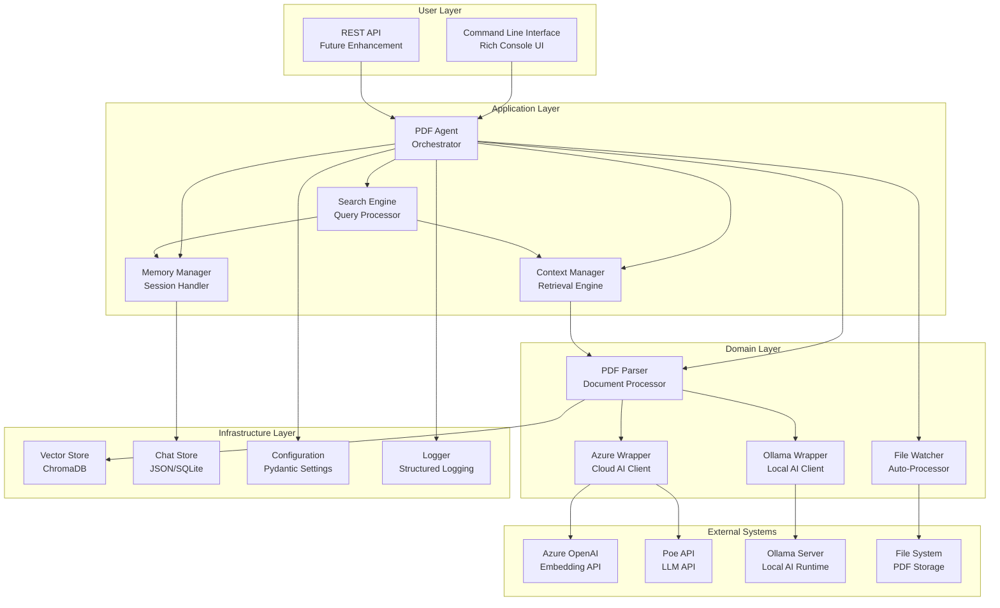
```mermaid
graph TB
    subgraph "User Layer"
        CLI[Command Line Interface<br/>Rich Console UI]
        API[REST API<br/>Future Enhancement]
    end

    subgraph "Application Layer"
        PA[PDF Agent<br/>Orchestrator]
        SE[Search Engine<br/>Query Processor]
        CM[Context Manager<br/>Retrieval Engine]
        MM[Memory Manager<br/>Session Handler]
    end

    subgraph "Domain Layer"
        PP[PDF Parser<br/>Document Processor]
        AW[Azure Wrapper<br/>Cloud AI Client]
        OW[Ollama Wrapper<br/>Local AI Client]
        FW[File Watcher<br/>Auto-Processor]
    end

    subgraph "Infrastructure Layer"
        VS[Vector Store<br/>ChromaDB]
        CH[Chat Store<br/>JSON/SQLite]
        CONF[Configuration<br/>Pydantic Settings]
        LOG[Logger<br/>Structured Logging]
    end

    subgraph "External Systems"
        AO[Azure OpenAI<br/>Embedding API]
        POE[Poe API<br/>LLM API]
        OL[Ollama Server<br/>Local AI Runtime]
        FS[File System<br/>PDF Storage]
    end

    CLI --> PA
    API --> PA

    PA --> SE
    PA --> CM
    PA --> MM
    PA --> PP
    PA --> FW

    SE --> CM
    SE --> MM

    CM --> PP
    PP --> AW
    PP --> OW

    MM --> CH

    PA --> CONF
    PA --> LOG

    AW --> AO
    AW --> POE
    OW --> OL

    PP --> VS
    FW --> FS
```

### Component Interaction Patterns

The system follows a layered architecture with clear separation of concerns:

- **User Layer**: Handles user interaction and presentation
- **Application Layer**: Contains business logic and orchestration
- **Domain Layer**: Implements core domain functionality
- **Infrastructure Layer**: Provides technical capabilities and persistence

### Design Patterns Implemented

#### 1. Strategy Pattern (AI Providers)
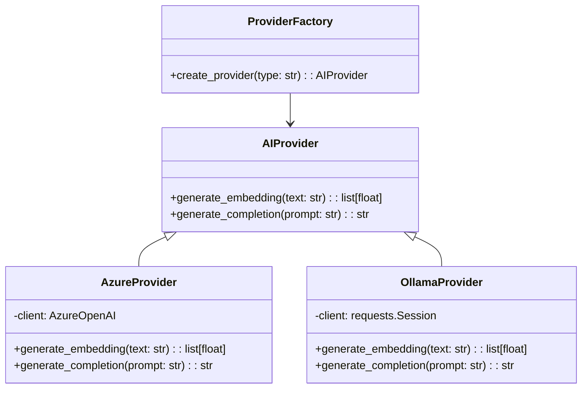
```mermaid
classDiagram
    class AIProvider {
        +generate_embedding(text: str): list[float]
        +generate_completion(prompt: str): str
    }

    class AzureProvider {
        -client: AzureOpenAI
        +generate_embedding(text: str): list[float]
        +generate_completion(prompt: str): str
    }

    class OllamaProvider {
        -client: requests.Session
        +generate_embedding(text: str): list[float]
        +generate_completion(prompt: str): str
    }

    class ProviderFactory {
        +create_provider(type: str): AIProvider
    }

    AIProvider <|-- AzureProvider
    AIProvider <|-- OllamaProvider
    ProviderFactory --> AIProvider
```

#### 2. Repository Pattern (Data Access)
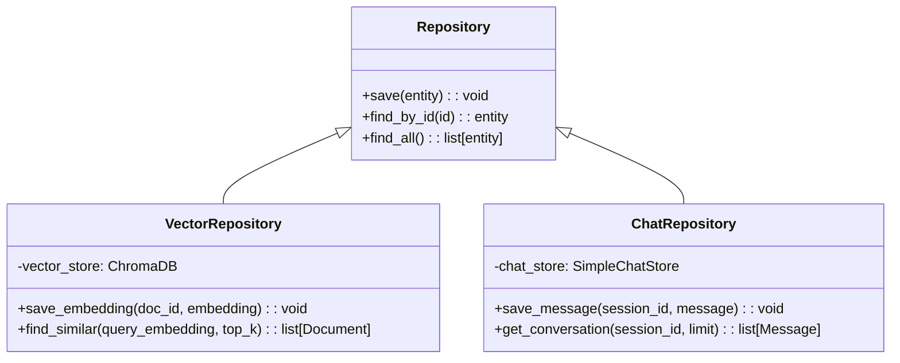
```mermaid
classDiagram
    class Repository {
        +save(entity): void
        +find_by_id(id): entity
        +find_all(): list[entity]
    }

    class VectorRepository {
        -vector_store: ChromaDB
        +save_embedding(doc_id, embedding): void
        +find_similar(query_embedding, top_k): list[Document]
    }

    class ChatRepository {
        -chat_store: SimpleChatStore
        +save_message(session_id, message): void
        +get_conversation(session_id, limit): list[Message]
    }

    Repository <|-- VectorRepository
    Repository <|-- ChatRepository
```

#### 3. Observer Pattern (File Monitoring)
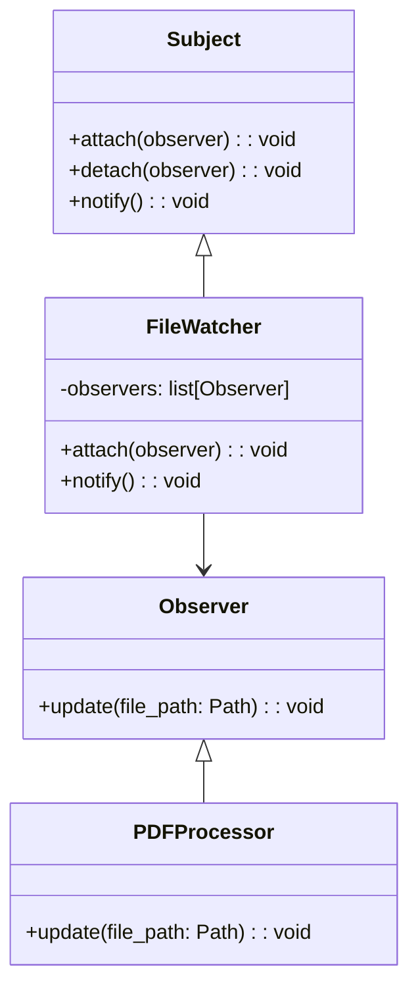
```mermaid
classDiagram
    class Subject {
        +attach(observer): void
        +detach(observer): void
        +notify(): void
    }

    class FileWatcher {
        -observers: list[Observer]
        +attach(observer): void
        +notify(): void
    }

    class Observer {
        +update(file_path: Path): void
    }

    class PDFProcessor {
        +update(file_path: Path): void
    }

    Subject <|-- FileWatcher
    Observer <|-- PDFProcessor
    FileWatcher --> Observer
```

---

## Core Component Implementation

### PDF Agent (Main Orchestrator)

#### Class Structure
```python
class PDFAgent:
    """Main AI Agent for PDF parsing, search, and context management"""

    def __init__(self, user_id: str = "default", auto_watch: bool = None):
        # Initialize core components
        self.pdf_parser = PDFParser()
        self.memory_manager = MemoryManager(user_id=user_id)
        self.index = self.pdf_parser.load_existing_index()

        # Lazy initialization of search components
        self.context_manager = None
        self.search_engine = None

        # Setup file watcher if enabled
        if auto_watch or settings.AUTO_WATCH:
            self.setup_file_watcher()

    def _ensure_search_ready(self):
        """Lazy initialization of search components"""
        if self.index is None:
            raise RuntimeError("No index available. Please process some PDFs first.")

        if self.context_manager is None:
            self.context_manager = ContextManager(self.index, self.memory_manager)

        if self.search_engine is None:
            self.search_engine = SearchEngine(self.context_manager, self.memory_manager)
```

#### Key Methods Implementation

##### Document Processing Flow
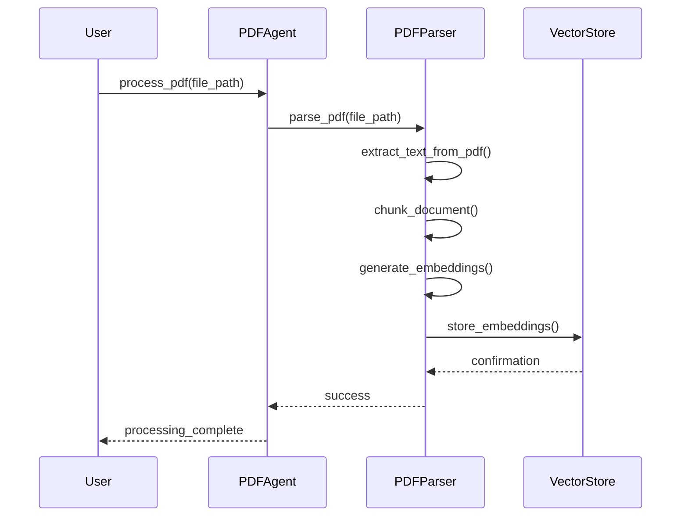
```mermaid
sequenceDiagram
    participant User
    participant PDFAgent
    participant PDFParser
    participant VectorStore

    User->>PDFAgent: process_pdf(file_path)
    PDFAgent->>PDFParser: parse_pdf(file_path)
    PDFParser->>PDFParser: extract_text_from_pdf()
    PDFParser->>PDFParser: chunk_document()
    PDFParser->>PDFParser: generate_embeddings()
    PDFParser->>VectorStore: store_embeddings()
    VectorStore-->>PDFParser: confirmation
    PDFParser-->>PDFAgent: success
    PDFAgent-->>User: processing_complete
```

##### Search Operation Flow
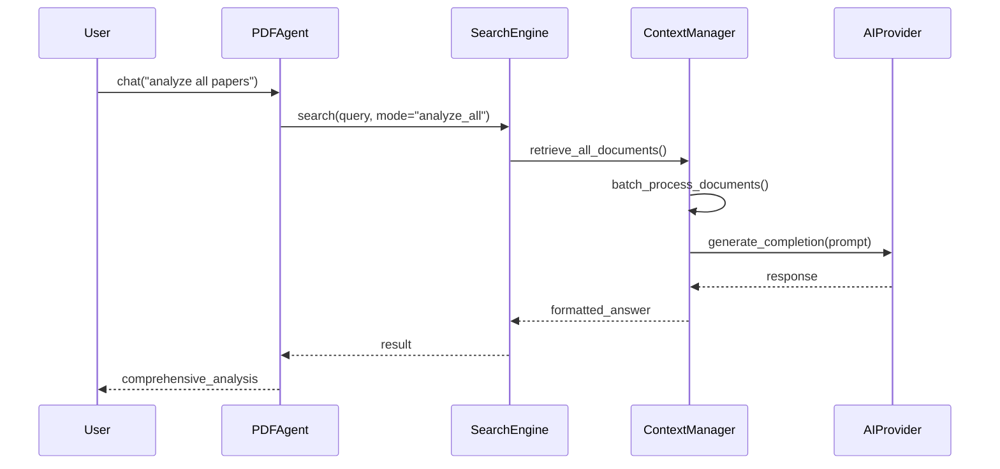
```mermaid
sequenceDiagram
    participant User
    participant PDFAgent
    participant SearchEngine
    participant ContextManager
    participant AIProvider

    User->>PDFAgent: chat("analyze all papers")
    PDFAgent->>SearchEngine: search(query, mode="analyze_all")
    SearchEngine->>ContextManager: retrieve_all_documents()
    ContextManager->>ContextManager: batch_process_documents()
    ContextManager->>AIProvider: generate_completion(prompt)
    AIProvider-->>ContextManager: response
    ContextManager-->>SearchEngine: formatted_answer
    SearchEngine-->>PDFAgent: result
    PDFAgent-->>User: comprehensive_analysis
```

### PDF Parser Implementation

#### Document Processing Pipeline
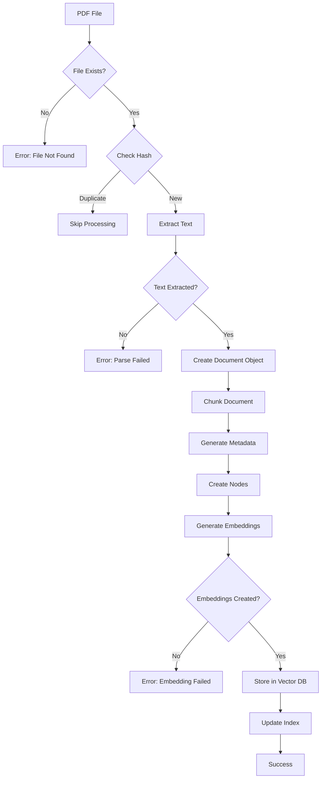
```mermaid
flowchart TD
    A[PDF File] --> B{File Exists?}
    B -->|No| C[Error: File Not Found]
    B -->|Yes| D{Check Hash}
    D -->|Duplicate| E[Skip Processing]
    D -->|New| F[Extract Text]

    F --> G{Text Extracted?}
    G -->|No| H[Error: Parse Failed]
    G -->|Yes| I[Create Document Object]

    I --> J[Chunk Document]
    J --> K[Generate Metadata]
    K --> L[Create Nodes]
    L --> M[Generate Embeddings]

    M --> N{Embeddings Created?}
    N -->|No| O[Error: Embedding Failed]
    N -->|Yes| P[Store in Vector DB]
    P --> Q[Update Index]
    Q --> R[Success]
```

#### Text Extraction Strategy
```python
def parse_pdf(self, file_path: Path) -> List[Document]:
    """Multi-strategy PDF parsing with fallback"""

    # Strategy 1: PyPDF2 (fast, basic)
    try:
        with open(file_path, 'rb') as file:
            pdf_reader = PyPDF2.PdfReader(file)
            text = ""
            for page in pdf_reader.pages:
                text += page.extract_text() + "\n"
        if text.strip():
            return [Document(text=text, metadata=self._create_metadata(file_path))]
    except Exception as e:
        log.warning(f"PyPDF2 extraction failed: {e}")

    # Strategy 2: PyMuPDF (better formatting)
    try:
        doc = fitz.open(str(file_path))
        text = ""
        for page in doc:
            text += page.get_text() + "\n"
        doc.close()
        if text.strip():
            return [Document(text=text, metadata=self._create_metadata(file_path))]
    except Exception as e:
        log.warning(f"PyMuPDF extraction failed: {e}")

    # Strategy 3: PDFPlumber (table extraction)
    try:
        with pdfplumber.open(file_path) as pdf:
            text = ""
            for page in pdf.pages:
                page_text = page.extract_text()
                if page_text:
                    text += page_text + "\n"
        if text.strip():
            return [Document(text=text, metadata=self._create_metadata(file_path))]
    except Exception as e:
        log.error(f"All PDF extraction strategies failed: {e}")
        return []
```

### AI Provider Integration

#### Azure OpenAI Implementation
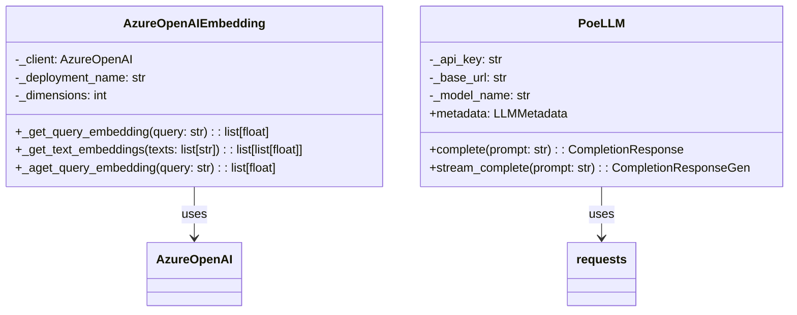
```mermaid
classDiagram
    class AzureOpenAIEmbedding {
        -_client: AzureOpenAI
        -_deployment_name: str
        -_dimensions: int

        +_get_query_embedding(query: str): list[float]
        +_get_text_embeddings(texts: list[str]): list[list[float]]
        +_aget_query_embedding(query: str): list[float]
    }

    class PoeLLM {
        -_api_key: str
        -_base_url: str
        -_model_name: str

        +complete(prompt: str): CompletionResponse
        +stream_complete(prompt: str): CompletionResponseGen
        +metadata: LLMMetadata
    }

    AzureOpenAIEmbedding --> AzureOpenAI : uses
    PoeLLM --> requests : uses
```

#### Ollama Implementation
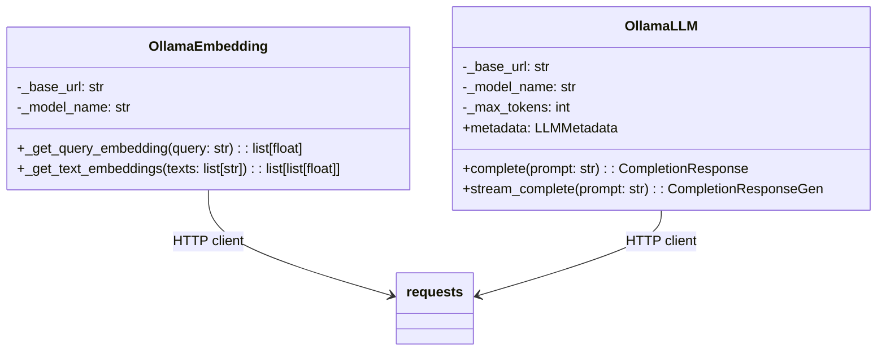
```mermaid
classDiagram
    class OllamaEmbedding {
        -_base_url: str
        -_model_name: str

        +_get_query_embedding(query: str): list[float]
        +_get_text_embeddings(texts: list[str]): list[list[float]]
    }

    class OllamaLLM {
        -_base_url: str
        -_model_name: str
        -_max_tokens: int

        +complete(prompt: str): CompletionResponse
        +stream_complete(prompt: str): CompletionResponseGen
        +metadata: LLMMetadata
    }

    OllamaEmbedding --> requests : HTTP client
    OllamaLLM --> requests : HTTP client
```

#### Provider Selection Logic
```python
def initialize_ai_providers():
    """Dynamic provider initialization based on configuration"""

    # Embedding Provider Selection
    if settings.EMBEDDING_PROVIDER.lower() == "azure":
        Settings.embed_model = AzureOpenAIEmbedding(
            api_key=settings.AZURE_OPENAI_API_KEY,
            azure_endpoint=settings.AZURE_OPENAI_ENDPOINT,
            deployment_name=settings.AZURE_OPENAI_EMBEDDING_DEPLOYMENT,
            dimensions=settings.AZURE_OPENAI_EMBEDDING_DIMENSION
        )
        log.info("✓ Azure OpenAI Embeddings configured")

    elif settings.EMBEDDING_PROVIDER.lower() == "ollama":
        Settings.embed_model = OllamaEmbedding(
            base_url=settings.OLLAMA_BASE_URL,
            model_name=settings.OLLAMA_EMBEDDING_MODEL
        )
        log.info(f"✓ Ollama Embeddings configured: {settings.OLLAMA_EMBEDDING_MODEL}")

    # LLM Provider Selection
    if settings.LLM_PROVIDER.lower() == "poe":
        Settings.llm = PoeLLM(
            api_key=settings.POE_API_KEY,
            model_name=settings.POE_MODEL_NAME,
            max_tokens=settings.POE_MAX_TOKENS,
            temperature=settings.POE_TEMPERATURE
        )
        log.info(f"✓ Poe LLM configured: {settings.POE_MODEL_NAME}")

    elif settings.LLM_PROVIDER.lower() == "ollama":
        Settings.llm = OllamaLLM(
            base_url=settings.OLLAMA_BASE_URL,
            model_name=settings.OLLAMA_CHAT_MODEL,
            max_tokens=settings.OLLAMA_MAX_TOKENS,
            temperature=settings.OLLAMA_TEMPERATURE
        )
        log.info(f"✓ Ollama LLM configured: {settings.OLLAMA_CHAT_MODEL}")
```

### Search Engine Implementation

#### Search Mode State Machine
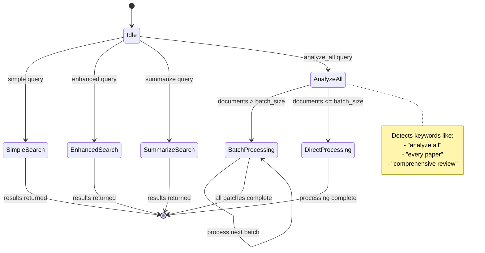
```mermaid
stateDiagram-v2
    [*] --> Idle

    Idle --> SimpleSearch : simple query
    Idle --> EnhancedSearch : enhanced query
    Idle --> SummarizeSearch : summarize query
    Idle --> AnalyzeAll : analyze_all query

    SimpleSearch --> [*] : results returned
    EnhancedSearch --> [*] : results returned
    SummarizeSearch --> [*] : results returned

    AnalyzeAll --> BatchProcessing : documents > batch_size
    AnalyzeAll --> DirectProcessing : documents <= batch_size

    BatchProcessing --> BatchProcessing : process next batch
    BatchProcessing --> [*] : all batches complete

    DirectProcessing --> [*] : processing complete

    note right of AnalyzeAll
        Detects keywords like:
        - "analyze all"
        - "every paper"
        - "comprehensive review"
    end note
```

#### Comprehensive Analysis Algorithm
```python
def _analyze_all_documents(self, query: str) -> Dict:
    """Comprehensive analysis of entire document collection"""

    # Retrieve ALL documents (not just top-k)
    all_documents = self.context_manager.retrieve_all_documents()

    # Batch processing to avoid token limits
    batch_size = 10
    all_responses = []

    for i in range(0, len(all_documents), batch_size):
        batch = all_documents[i:i + batch_size]

        # Create batch prompt
        batch_context = self._format_batch_context(batch)
        batch_prompt = self._create_analysis_prompt(query, batch_context)

        # Process batch
        try:
            response = self._call_llm_with_retry(batch_prompt)
            all_responses.append({
                'batch': i // batch_size + 1,
                'documents': [doc['metadata']['file_name'] for doc in batch],
                'response': response,
                'success': True
            })
        except Exception as e:
            all_responses.append({
                'batch': i // batch_size + 1,
                'documents': [doc['metadata']['file_name'] for doc in batch],
                'error': str(e),
                'success': False
            })

    # Synthesize final response
    final_answer = self._synthesize_batch_responses(query, all_responses)

    return {
        "query": query,
        "answer": final_answer,
        "mode": "analyze_all",
        "batches_processed": len(all_responses),
        "total_documents": len(all_documents),
        "batch_details": all_responses,
        "timestamp": datetime.now().isoformat()
    }
```

### Context Manager Implementation

#### Retrieval Strategy
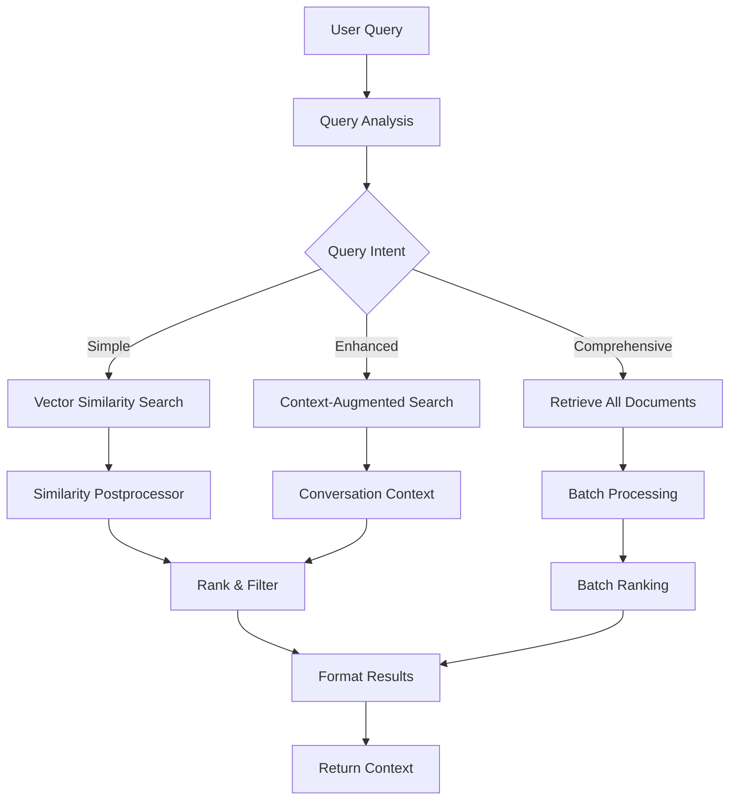
```mermaid
flowchart TD
    A[User Query] --> B[Query Analysis]
    B --> C{Query Intent}

    C -->|Simple| D[Vector Similarity Search]
    C -->|Enhanced| E[Context-Augmented Search]
    C -->|Comprehensive| F[Retrieve All Documents]

    D --> G[Similarity Postprocessor]
    E --> H[Conversation Context]
    F --> I[Batch Processing]

    G --> J[Rank & Filter]
    H --> J
    I --> K[Batch Ranking]

    J --> L[Format Results]
    K --> L

    L --> M[Return Context]
```

#### Context Enhancement Algorithm
```python
def build_enhanced_context(self, query: str, include_memory: bool = True, top_k: int = 30):
    """Build comprehensive context for enhanced search"""

    # Retrieve relevant document chunks
    doc_contexts = self.retrieve_context(query, top_k=top_k)

    # Extract unique sources
    sources = self._get_unique_sources(doc_contexts)

    # Format document context
    doc_context_text = "\n\n".join([
        f"[Document: {ctx['metadata'].get('file_name', 'Unknown')}]\n{ctx['text']}"
        for ctx in doc_contexts
    ])

    # Add conversation context if requested
    conversation_context = ""
    if include_memory:
        conversation_context = self.memory_manager.get_conversation_context()

    # Build enhanced context object
    enhanced_context = {
        "query": query,
        "document_context": doc_context_text,
        "conversation_context": conversation_context,
        "retrieved_chunks": len(doc_contexts),
        "sources": sources,
        "timestamp": datetime.now().isoformat()
    }

    return enhanced_context
```

---

## Data Flow Architecture

### Document Ingestion Flow
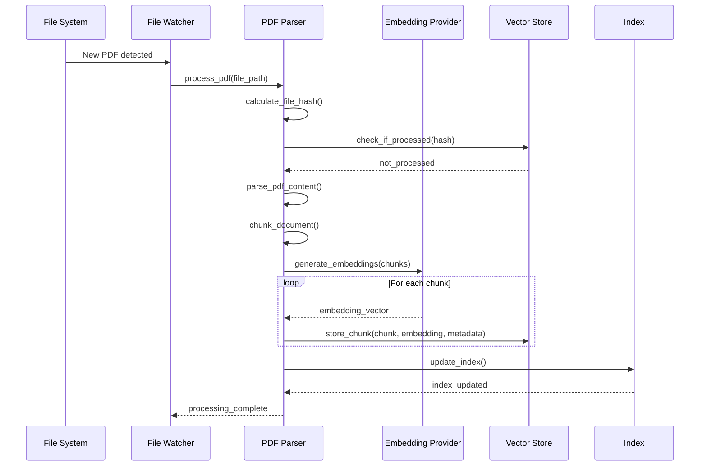
```mermaid
sequenceDiagram
    participant FS as File System
    participant FW as File Watcher
    participant PP as PDF Parser
    participant EP as Embedding Provider
    participant VS as Vector Store
    participant IDX as Index

    FS->>FW: New PDF detected
    FW->>PP: process_pdf(file_path)

    PP->>PP: calculate_file_hash()
    PP->>VS: check_if_processed(hash)
    VS-->>PP: not_processed

    PP->>PP: parse_pdf_content()
    PP->>PP: chunk_document()
    PP->>EP: generate_embeddings(chunks)

    loop For each chunk
        EP-->>PP: embedding_vector
        PP->>VS: store_chunk(chunk, embedding, metadata)
    end

    PP->>IDX: update_index()
    IDX-->>PP: index_updated
    PP-->>FW: processing_complete
```

### Query Processing Flow
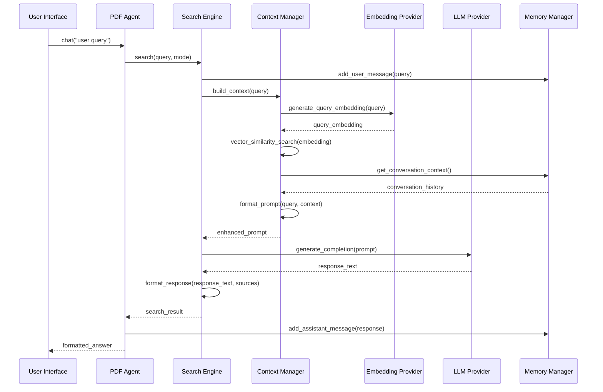
```mermaid
sequenceDiagram
    participant UI as User Interface
    participant PA as PDF Agent
    participant SE as Search Engine
    participant CM as Context Manager
    participant EP as Embedding Provider
    participant LP as LLM Provider
    participant MM as Memory Manager

    UI->>PA: chat("user query")
    PA->>SE: search(query, mode)

    SE->>MM: add_user_message(query)
    SE->>CM: build_context(query)

    CM->>EP: generate_query_embedding(query)
    EP-->>CM: query_embedding

    CM->>CM: vector_similarity_search(embedding)
    CM->>MM: get_conversation_context()
    MM-->>CM: conversation_history

    CM->>CM: format_prompt(query, context)
    CM-->>SE: enhanced_prompt

    SE->>LP: generate_completion(prompt)
    LP-->>SE: response_text

    SE->>SE: format_response(response_text, sources)
    SE-->>PA: search_result
    PA->>MM: add_assistant_message(response)
    PA-->>UI: formatted_answer
```

### Memory Management Flow
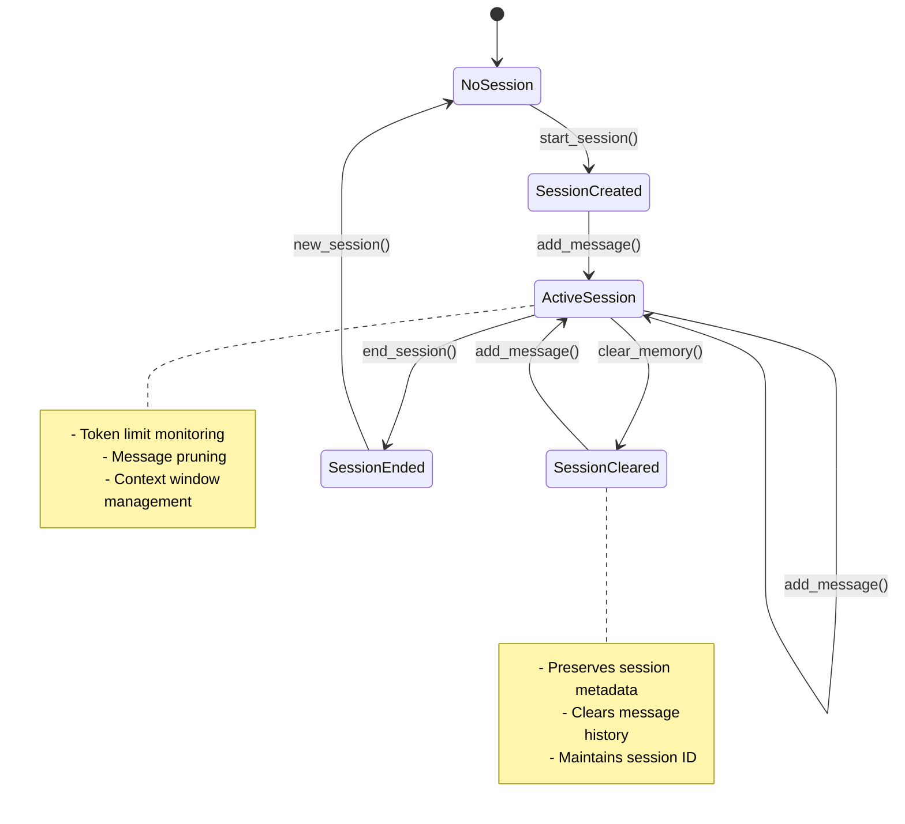
```mermaid
stateDiagram-v2
    [*] --> NoSession

    NoSession --> SessionCreated : start_session()
    SessionCreated --> ActiveSession : add_message()

    ActiveSession --> ActiveSession : add_message()
    ActiveSession --> SessionCleared : clear_memory()
    ActiveSession --> SessionEnded : end_session()

    SessionCleared --> ActiveSession : add_message()
    SessionEnded --> NoSession : new_session()

    note right of ActiveSession
        - Token limit monitoring
        - Message pruning
        - Context window management
    end note

    note right of SessionCleared
        - Preserves session metadata
        - Clears message history
        - Maintains session ID
    end note
```

---

## AI Provider Integration

### Azure OpenAI Integration Details

#### Authentication Flow
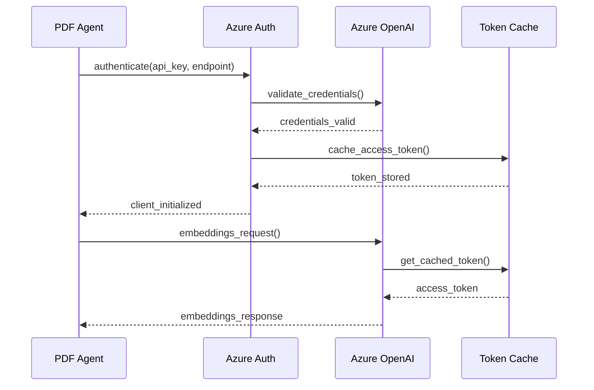
```mermaid
sequenceDiagram
    participant App as PDF Agent
    participant Auth as Azure Auth
    participant AO as Azure OpenAI
    participant Token as Token Cache

    App->>Auth: authenticate(api_key, endpoint)
    Auth->>AO: validate_credentials()
    AO-->>Auth: credentials_valid

    Auth->>Token: cache_access_token()
    Token-->>Auth: token_stored

    Auth-->>App: client_initialized

    App->>AO: embeddings_request()
    AO->>Token: get_cached_token()
    Token-->>AO: access_token
    AO-->>App: embeddings_response
```

#### Batch Processing Implementation
```python
def _get_text_embeddings(self, texts: list[str]) -> list[list[float]]:
    """Optimized batch processing with rate limiting"""

    batch_size = 100  # Azure OpenAI limit
    all_embeddings = []

    for i in range(0, len(texts), batch_size):
        batch = texts[i:i + batch_size]

        # Implement exponential backoff retry
        max_retries = 3
        for attempt in range(max_retries):
            try:
                response = self._client.embeddings.create(
                    input=batch,
                    model=self._deployment_name
                )

                embeddings = [data.embedding for data in response.data]
                all_embeddings.extend(embeddings)
                break  # Success, exit retry loop

            except RateLimitError:
                if attempt < max_retries - 1:
                    wait_time = (2 ** attempt) * 60  # Exponential backoff
                    log.warning(f"Rate limited, waiting {wait_time}s")
                    time.sleep(wait_time)
                else:
                    raise

            except Exception as e:
                log.error(f"Batch embedding failed: {e}")
                if attempt == max_retries - 1:
                    raise
                time.sleep(1)

    return all_embeddings
```

### Ollama Integration Details

#### Local API Communication
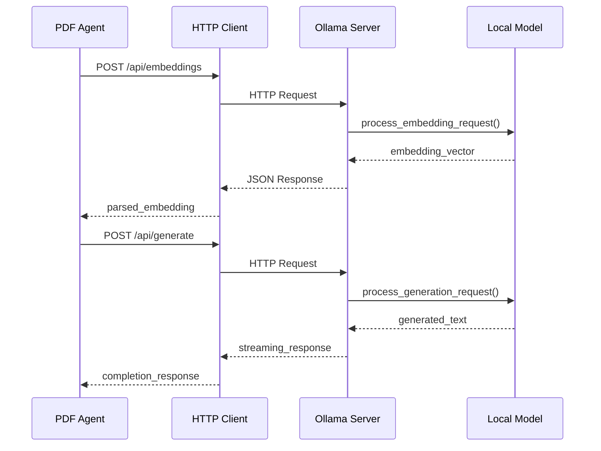
```mermaid
sequenceDiagram
    participant App as PDF Agent
    participant HTTP as HTTP Client
    participant OL as Ollama Server
    participant Model as Local Model

    App->>HTTP: POST /api/embeddings
    HTTP->>OL: HTTP Request
    OL->>Model: process_embedding_request()
    Model-->>OL: embedding_vector
    OL-->>HTTP: JSON Response
    HTTP-->>App: parsed_embedding

    App->>HTTP: POST /api/generate
    HTTP->>OL: HTTP Request
    OL->>Model: process_generation_request()
    Model-->>OL: generated_text
    OL-->>HTTP: streaming_response
    HTTP-->>App: completion_response
```

#### Connection Management
```python
class OllamaClient:
    """Robust Ollama HTTP client with connection pooling"""

    def __init__(self, base_url: str):
        self.base_url = base_url.rstrip('/')
        self.session = requests.Session()

        # Configure connection pooling
        adapter = HTTPAdapter(
            pool_connections=10,
            pool_maxsize=10,
            max_retries=Retry(
                total=3,
                backoff_factor=1,
                status_forcelist=[500, 502, 503, 504]
            )
        )
        self.session.mount('http://', adapter)
        self.session.mount('https://', adapter)

    def embeddings_request(self, model: str, prompt: str) -> dict:
        """Generate embeddings with error handling"""
        url = f"{self.base_url}/api/embeddings"
        payload = {"model": model, "prompt": prompt}

        try:
            response = self.session.post(url, json=payload, timeout=30)
            response.raise_for_status()
            return response.json()
        except requests.exceptions.Timeout:
            log.error("Ollama embeddings request timed out")
            raise
        except requests.exceptions.ConnectionError:
            log.error("Cannot connect to Ollama server")
            raise
        except requests.exceptions.HTTPError as e:
            log.error(f"Ollama API error: {e}")
            raise

    def generate_request(self, model: str, prompt: str, options: dict = None) -> dict:
        """Generate text with streaming support"""
        url = f"{self.base_url}/api/generate"
        payload = {
            "model": model,
            "prompt": prompt,
            "stream": False
        }
        if options:
            payload["options"] = options

        response = self.session.post(url, json=payload, timeout=300)
        response.raise_for_status()
        return response.json()
```

### Provider Selection Logic

#### Configuration-Driven Initialization
```python
def create_ai_provider(provider_type: str, provider_config: dict) -> AIProvider:
    """Factory method for AI provider creation"""

    if provider_type == "azure":
        return AzureProvider(
            api_key=provider_config.get("api_key"),
            endpoint=provider_config.get("endpoint"),
            deployment=provider_config.get("deployment"),
            dimensions=provider_config.get("dimensions", 3072)
        )

    elif provider_type == "ollama":
        return OllamaProvider(
            base_url=provider_config.get("base_url", "http://localhost:11434"),
            embedding_model=provider_config.get("embedding_model", "nomic-embed-text"),
            chat_model=provider_config.get("chat_model", "llama2")
        )

    else:
        raise ValueError(f"Unsupported provider type: {provider_type}")

# Usage in settings initialization
embedding_provider = create_ai_provider(
    settings.EMBEDDING_PROVIDER,
    {
        "api_key": settings.AZURE_OPENAI_API_KEY,
        "endpoint": settings.AZURE_OPENAI_ENDPOINT,
        "deployment": settings.AZURE_OPENAI_EMBEDDING_DEPLOYMENT,
        "base_url": settings.OLLAMA_BASE_URL,
        "embedding_model": settings.OLLAMA_EMBEDDING_MODEL
    }
)
```

---

## Configuration Management

### Hierarchical Configuration System
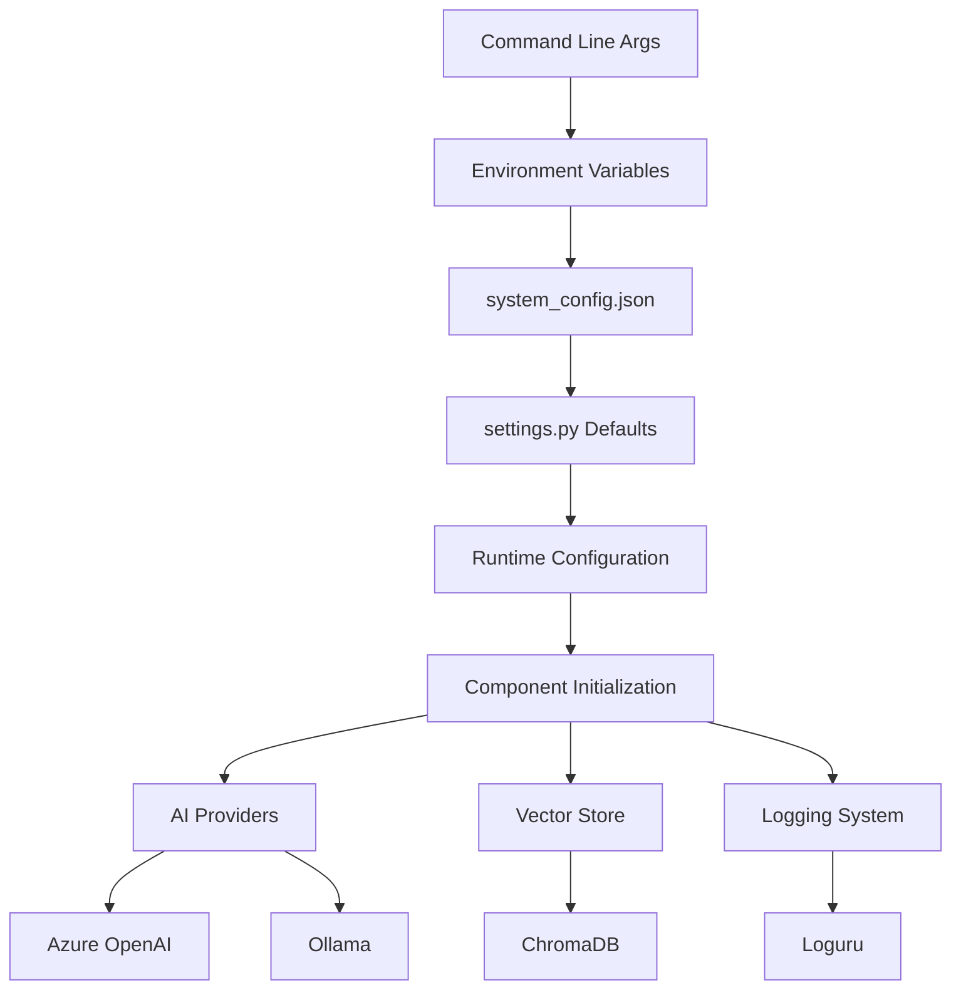
```mermaid
graph TD
    A[Command Line Args] --> B[Environment Variables]
    B --> C[system_config.json]
    C --> D[settings.py Defaults]
    D --> E[Runtime Configuration]

    E --> F[Component Initialization]
    F --> G[AI Providers]
    F --> H[Vector Store]
    F --> I[Logging System]

    G --> J[Azure OpenAI]
    G --> K[Ollama]
    H --> L[ChromaDB]
    I --> M[Loguru]
```

### Configuration Loading Algorithm
```python
def load_configuration() -> Settings:
    """Multi-source configuration loading with precedence"""

    # Start with defaults
    config = Settings()

    # Override with system_config.json
    system_config_path = Path("system_config.json")
    if system_config_path.exists():
        with open(system_config_path, 'r') as f:
            system_config = json.load(f)

        # Apply configuration sections
        config = apply_system_config(config, system_config)

    # Override with environment variables
    config = apply_environment_variables(config)

    # Validate configuration
    validate_configuration(config)

    return config

def apply_system_config(config: Settings, system_config: dict) -> Settings:
    """Apply system configuration with validation"""

    # Azure OpenAI settings
    if "azure_openai" in system_config:
        azure_config = system_config["azure_openai"]
        config.AZURE_OPENAI_API_KEY = azure_config.get("api_key", config.AZURE_OPENAI_API_KEY)
        config.AZURE_OPENAI_ENDPOINT = azure_config.get("endpoint_url", config.AZURE_OPENAI_ENDPOINT)

    # Ollama settings
    if "ollama_service" in system_config:
        ollama_config = system_config["ollama_service"]
        config.OLLAMA_BASE_URL = ollama_config.get("base_url", config.OLLAMA_BASE_URL)
        config.OLLAMA_EMBEDDING_MODEL = ollama_config.get("embedding_model", config.OLLAMA_EMBEDDING_MODEL)

    # Provider selection
    if "agents" in system_config and "pdf_agent" in system_config["agents"]:
        agent_config = system_config["agents"]["pdf_agent"]
        if "config" in agent_config:
            provider_config = agent_config["config"]
            config.EMBEDDING_PROVIDER = provider_config.get("embedding_provider", config.EMBEDDING_PROVIDER)
            config.LLM_PROVIDER = provider_config.get("llm_provider", config.LLM_PROVIDER)

    return config
```

### Runtime Configuration Updates
```python
def update_provider_settings(new_embedding_provider: str, new_llm_provider: str):
    """Runtime provider switching with validation"""

    # Validate provider availability
    if new_embedding_provider not in ["azure", "ollama"]:
        raise ValueError(f"Unsupported embedding provider: {new_embedding_provider}")

    if new_llm_provider not in ["poe", "ollama"]:
        raise ValueError(f"Unsupported LLM provider: {new_llm_provider}")

    # Check provider connectivity
    if not test_provider_connectivity(new_embedding_provider):
        raise RuntimeError(f"Cannot connect to {new_embedding_provider} provider")

    if not test_provider_connectivity(new_llm_provider):
        raise RuntimeError(f"Cannot connect to {new_llm_provider} provider")

    # Update settings
    settings.EMBEDDING_PROVIDER = new_embedding_provider
    settings.LLM_PROVIDER = new_llm_provider

    # Persist to configuration file
    save_runtime_configuration(settings)

    # Trigger system restart notification
    log.warning("Provider changes require system restart to take effect")
```

---

## Performance Optimization

### Memory Management Strategies
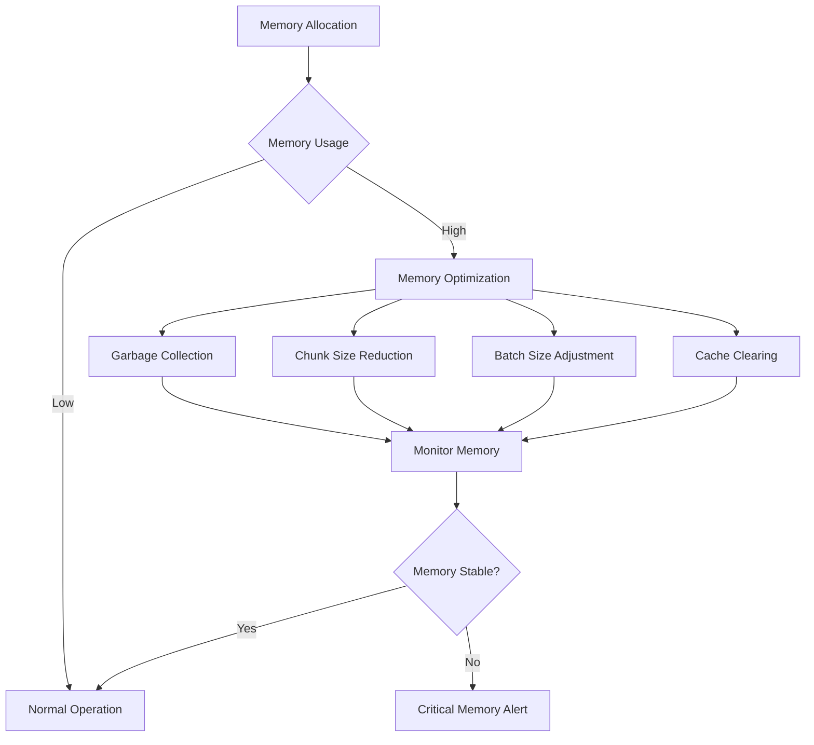
```mermaid
graph TD
    A[Memory Allocation] --> B{Memory Usage}
    B -->|Low| C[Normal Operation]
    B -->|High| D[Memory Optimization]

    D --> E[Garbage Collection]
    D --> F[Chunk Size Reduction]
    D --> G[Batch Size Adjustment]
    D --> H[Cache Clearing]

    E --> I[Monitor Memory]
    F --> I
    G --> I
    H --> I

    I --> J{Memory Stable?}
    J -->|Yes| C
    J -->|No| K[Critical Memory Alert]
```

### Vector Search Optimization
```python
class OptimizedVectorStore:
    """Performance-optimized vector operations"""

    def __init__(self, chroma_client):
        self.client = chroma_client
        self.cache = {}  # Simple LRU cache
        self.cache_size = 1000

    def similarity_search(self, query_embedding: list[float], top_k: int = 20) -> list[dict]:
        """Optimized similarity search with caching"""

        # Check cache first
        cache_key = self._get_cache_key(query_embedding, top_k)
        if cache_key in self.cache:
            return self.cache[cache_key]

        # Perform search
        results = self.client.similarity_search(query_embedding, top_k=top_k)

        # Cache results
        if len(self.cache) >= self.cache_size:
            # Remove oldest entry (simple LRU)
            oldest_key = next(iter(self.cache))
            del self.cache[oldest_key]

        self.cache[cache_key] = results
        return results

    def _get_cache_key(self, embedding: list[float], top_k: int) -> str:
        """Generate cache key from embedding and parameters"""
        # Use first few dimensions and parameters for cache key
        embedding_hash = hash(tuple(embedding[:10]))  # First 10 dimensions
        return f"{embedding_hash}_{top_k}"
```

### Batch Processing Optimization
```python
def optimized_batch_processing(documents: list[Document], batch_size: int = 10):
    """Memory-efficient batch processing with progress tracking"""

    total_docs = len(documents)
    processed_results = []

    for i in range(0, total_docs, batch_size):
        batch = documents[i:i + batch_size]
        batch_number = i // batch_size + 1
        total_batches = (total_docs + batch_size - 1) // batch_size

        log.info(f"Processing batch {batch_number}/{total_batches} ({len(batch)} documents)")

        try:
            # Process batch
            batch_results = process_document_batch(batch)

            # Memory cleanup after each batch
            gc.collect()

            processed_results.extend(batch_results)

        except Exception as e:
            log.error(f"Batch {batch_number} failed: {e}")
            # Continue with next batch or implement retry logic

    return processed_results
```

### Performance Monitoring
```python
class PerformanceMonitor:
    """Real-time performance tracking and alerting"""

    def __init__(self):
        self.metrics = {}
        self.thresholds = {
            'search_time': 30.0,  # seconds
            'memory_usage': 0.8,  # 80% of available
            'api_latency': 5.0,   # seconds
            'error_rate': 0.05    # 5% error rate
        }

    def track_operation(self, operation_name: str, start_time: float, **kwargs):
        """Track operation performance"""

        duration = time.time() - start_time
        self.metrics[operation_name] = {
            'duration': duration,
            'timestamp': time.time(),
            'metadata': kwargs
        }

        # Check thresholds
        if operation_name == 'search' and duration > self.thresholds['search_time']:
            log.warning(f"Slow search detected: {duration:.2f}s")

        if operation_name == 'api_call' and duration > self.thresholds['api_latency']:
            log.warning(f"High API latency: {duration:.2f}s")

    def get_performance_report(self) -> dict:
        """Generate performance summary"""

        report = {
            'total_operations': len(self.metrics),
            'average_search_time': self._calculate_average('search'),
            'memory_usage': psutil.virtual_memory().percent / 100,
            'error_rate': self._calculate_error_rate(),
            'peak_memory_usage': max(self.metrics.values(), key=lambda x: x.get('memory', 0))
        }

        return report
```

---

## Security Implementation

### Authentication and Authorization
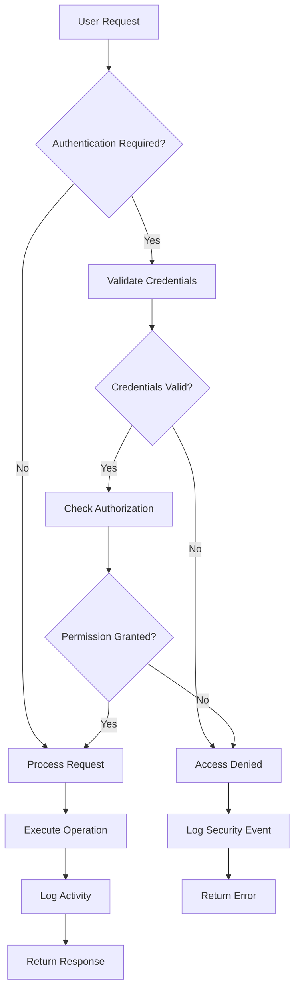
```mermaid
graph TD
    A[User Request] --> B{Authentication Required?}
    B -->|No| C[Process Request]
    B -->|Yes| D[Validate Credentials]

    D --> E{Credentials Valid?}
    E -->|No| F[Access Denied]
    E -->|Yes| G[Check Authorization]

    G --> H{Permission Granted?}
    H -->|No| F
    H -->|Yes| C

    C --> I[Execute Operation]
    I --> J[Log Activity]
    J --> K[Return Response]

    F --> L[Log Security Event]
    L --> M[Return Error]
```

### Credential Management
```python
class SecureCredentialManager:
    """Secure credential storage and access"""

    def __init__(self, keyring_available: bool = True):
        self.keyring_available = keyring_available
        self.encryption_key = self._generate_encryption_key()

    def store_credential(self, service: str, username: str, password: str):
        """Securely store credentials"""

        if self.keyring_available:
            # Use system keyring
            keyring.set_password(service, username, password)
        else:
            # Encrypt and store locally
            encrypted_password = self._encrypt_password(password)
            self._store_encrypted_credential(service, username, encrypted_password)

    def get_credential(self, service: str, username: str) -> str:
        """Retrieve credentials securely"""

        if self.keyring_available:
            return keyring.get_password(service, username)
        else:
            encrypted_password = self._get_encrypted_credential(service, username)
            return self._decrypt_password(encrypted_password)

    def _encrypt_password(self, password: str) -> str:
        """Encrypt password using Fernet"""
        f = Fernet(self.encryption_key)
        return f.encrypt(password.encode()).decode()

    def _decrypt_password(self, encrypted_password: str) -> str:
        """Decrypt password"""
        f = Fernet(self.encryption_key)
        return f.decrypt(encrypted_password.encode()).decode()

    def _generate_encryption_key(self) -> bytes:
        """Generate or retrieve encryption key"""
        key_file = Path.home() / ".pdf_agent" / "encryption.key"

        if key_file.exists():
            with open(key_file, 'rb') as f:
                return f.read()
        else:
            # Generate new key
            key = Fernet.generate_key()
            key_file.parent.mkdir(exist_ok=True)
            with open(key_file, 'wb') as f:
                f.write(key)
            return key
```

### API Security
```python
class SecureAPIClient:
    """Security-hardened API client"""

    def __init__(self, base_url: str, api_key: str = None):
        self.base_url = base_url
        self.api_key = api_key
        self.session = requests.Session()

        # Security configurations
        self.session.headers.update({
            'User-Agent': 'PDF-Agent/1.0',
            'Accept': 'application/json',
            'Content-Type': 'application/json'
        })

        # SSL/TLS configuration
        self.session.verify = True  # Verify SSL certificates

        # Timeout configuration
        self.timeout = (10, 300)  # (connect, read) timeouts

    def secure_request(self, method: str, endpoint: str, **kwargs) -> requests.Response:
        """Make secure API request with validation"""

        url = f"{self.base_url.rstrip('/')}/{endpoint.lstrip('/')}"

        # Add authentication if required
        if self.api_key:
            if 'headers' not in kwargs:
                kwargs['headers'] = {}
            kwargs['headers']['Authorization'] = f'Bearer {self.api_key}'

        # Input validation
        self._validate_request_data(kwargs.get('json', {}))
        self._validate_request_data(kwargs.get('data', {}))

        # Rate limiting (simple implementation)
        self._check_rate_limit()

        try:
            response = self.session.request(method, url, timeout=self.timeout, **kwargs)

            # Response validation
            self._validate_response(response)

            return response

        except requests.exceptions.SSLError:
            log.error("SSL certificate validation failed")
            raise
        except requests.exceptions.Timeout:
            log.error("Request timed out")
            raise
        except requests.exceptions.RequestException as e:
            log.error(f"Request failed: {e}")
            raise

    def _validate_request_data(self, data: dict):
        """Validate request data for security"""
        if not isinstance(data, dict):
            return

        # Check for potentially dangerous content
        dangerous_keys = ['__class__', '__subclass__', '__import__']
        for key in data.keys():
            if any(dangerous in str(key).lower() for dangerous in dangerous_keys):
                raise ValueError(f"Potentially dangerous key detected: {key}")

    def _validate_response(self, response: requests.Response):
        """Validate response for security"""
        # Check content type
        content_type = response.headers.get('content-type', '')
        if not content_type.startswith('application/json'):
            log.warning(f"Unexpected content type: {content_type}")

        # Check response size
        if len(response.content) > 10 * 1024 * 1024:  # 10MB limit
            raise ValueError("Response too large")

    def _check_rate_limit(self):
        """Simple rate limiting implementation"""
        # Implementation would track requests per time window
        pass
```

---

## Error Handling & Recovery

### Error Classification System
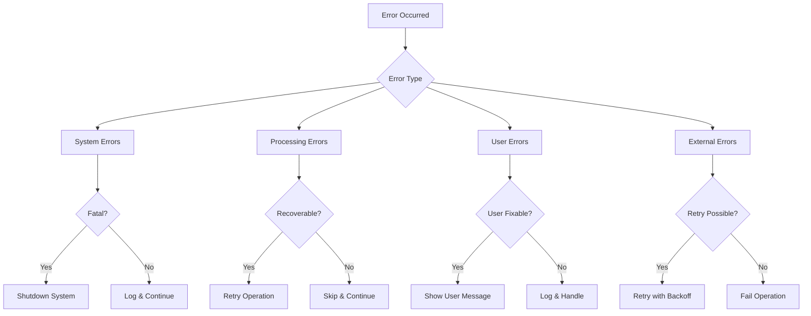
```mermaid
graph TD
    A[Error Occurred] --> B{Error Type}

    B --> C[System Errors]
    B --> D[Processing Errors]
    B --> E[User Errors]
    B --> F[External Errors]

    C --> G{Fatal?}
    D --> H{Recoverable?}
    E --> I{User Fixable?}
    F --> J{Retry Possible?}

    G -->|Yes| K[Shutdown System]
    G -->|No| L[Log & Continue]

    H -->|Yes| M[Retry Operation]
    H -->|No| N[Skip & Continue]

    I -->|Yes| O[Show User Message]
    I -->|No| P[Log & Handle]

    J -->|Yes| Q[Retry with Backoff]
    J -->|No| R[Fail Operation]
```

### Comprehensive Error Handler
```python
class ErrorHandler:
    """Centralized error handling and recovery"""

    def __init__(self):
        self.error_counts = {}
        self.recovery_strategies = {
            'connection_error': self._handle_connection_error,
            'rate_limit_error': self._handle_rate_limit_error,
            'parsing_error': self._handle_parsing_error,
            'memory_error': self._handle_memory_error,
            'authentication_error': self._handle_authentication_error
        }

    def handle_error(self, error: Exception, context: dict = None) -> ErrorResponse:
        """Main error handling entry point"""

        error_type = self._classify_error(error)
        error_context = context or {}

        # Log error with context
        self._log_error(error, error_type, error_context)

        # Update error statistics
        self._update_error_stats(error_type)

        # Attempt recovery
        recovery_result = self._attempt_recovery(error_type, error, error_context)

        if recovery_result.success:
            return ErrorResponse(
                handled=True,
                message=recovery_result.message,
                recovery_action=recovery_result.action
            )
        else:
            # Create user-friendly error response
            user_message = self._create_user_message(error_type, error)
            return ErrorResponse(
                handled=False,
                message=user_message,
                technical_details=str(error),
                suggested_actions=self._get_suggested_actions(error_type)
            )

    def _classify_error(self, error: Exception) -> str:
        """Classify error type for appropriate handling"""

        error_mappings = {
            (ConnectionError, requests.exceptions.ConnectionError): 'connection_error',
            (TimeoutError, requests.exceptions.Timeout): 'timeout_error',
            (ValueError, TypeError): 'parsing_error',
            MemoryError: 'memory_error',
            PermissionError: 'permission_error'
        }

        for error_classes, error_type in error_mappings.items():
            if isinstance(error, error_classes):
                return error_type

        return 'unknown_error'

    def _attempt_recovery(self, error_type: str, error: Exception, context: dict) -> RecoveryResult:
        """Attempt automatic error recovery"""

        if error_type in self.recovery_strategies:
            try:
                return self.recovery_strategies[error_type](error, context)
            except Exception as recovery_error:
                log.error(f"Recovery failed: {recovery_error}")
                return RecoveryResult(success=False, message="Recovery failed")

        return RecoveryResult(success=False, message="No recovery strategy available")

    def _handle_connection_error(self, error: Exception, context: dict) -> RecoveryResult:
        """Handle connection errors with retry logic"""

        retry_count = context.get('retry_count', 0)
        max_retries = context.get('max_retries', 3)

        if retry_count < max_retries:
            wait_time = min(2 ** retry_count, 60)  # Exponential backoff, max 60s
            return RecoveryResult(
                success=True,
                message=f"Retrying connection in {wait_time} seconds",
                action=f"retry_after_{wait_time}s",
                wait_time=wait_time
            )

        return RecoveryResult(
            success=False,
            message="Connection failed after maximum retries"
        )

    def _handle_rate_limit_error(self, error: Exception, context: dict) -> RecoveryResult:
        """Handle API rate limiting"""

        # Extract retry-after header if available
        retry_after = context.get('retry_after', 60)  # Default 60 seconds

        return RecoveryResult(
            success=True,
            message=f"Rate limited, retrying in {retry_after} seconds",
            action=f"retry_after_{retry_after}s",
            wait_time=retry_after
        )

    def _create_user_message(self, error_type: str, error: Exception) -> str:
        """Create user-friendly error messages"""

        user_messages = {
            'connection_error': "Unable to connect to the AI service. Please check your internet connection.",
            'authentication_error': "Authentication failed. Please check your API credentials.",
            'parsing_error': "Unable to process the document. The file may be corrupted or in an unsupported format.",
            'memory_error': "Insufficient memory to process the request. Try reducing the document size or batch size.",
            'rate_limit_error': "AI service rate limit exceeded. The system will automatically retry.",
            'permission_error': "Permission denied. Please check file permissions and access rights."
        }

        return user_messages.get(error_type, f"An unexpected error occurred: {str(error)}")

    def _get_suggested_actions(self, error_type: str) -> list[str]:
        """Provide suggested actions for error resolution"""

        suggestions = {
            'connection_error': [
                "Check your internet connection",
                "Verify the service is running (for Ollama)",
                "Check firewall settings"
            ],
            'authentication_error': [
                "Verify API keys in system_config.json",
                "Check account permissions",
                "Regenerate API keys if necessary"
            ],
            'parsing_error': [
                "Ensure the PDF file is not corrupted",
                "Try a different PDF file",
                "Check file permissions"
            ]
        }

        return suggestions.get(error_type, ["Contact system administrator for assistance"])
```

---

## Testing Strategy

### Unit Testing Framework
```mermaid
graph TD
    A[Test Suite] --> B[Component Tests]
    A --> C[Integration Tests]
    A --> D[End-to-End Tests]

    B --> E[AI Provider Tests]
    B --> F[Parser Tests]
    B --> G[Search Engine Tests]

    C --> H[API Integration Tests]
    C --> I[Database Integration Tests]

    D --> J[User Workflow Tests]
    D --> K[Performance Tests]

    E --> L[Mock AI Services]
    F --> M[Test PDF Files]
    G --> N[Embedded Test Data]
```

### Test Implementation Examples
```python
import pytest
from unittest.mock import Mock, patch
from core.pdf_parser import PDFParser
from core.ollama_wrapper import OllamaEmbedding

class TestPDFParser:
    """Unit tests for PDF parser component"""

    @pytest.fixture
    def parser(self):
        """Create parser instance for testing"""
        return PDFParser()

    @pytest.fixture
    def sample_pdf_path(self, tmp_path):
        """Create a sample PDF for testing"""
        pdf_path = tmp_path / "test.pdf"
        # Create minimal PDF content
        return pdf_path

    def test_parse_pdf_success(self, parser, sample_pdf_path):
        """Test successful PDF parsing"""
        documents = parser.parse_pdf(sample_pdf_path)

        assert len(documents) > 0
        assert "text" in documents[0]
        assert "metadata" in documents[0]

    def test_parse_pdf_nonexistent_file(self, parser):
        """Test parsing non-existent file"""
        documents = parser.parse_pdf(Path("/nonexistent/file.pdf"))

        assert documents == []

    @patch('core.pdf_parser.fitz')
    def test_parse_pdf_fallback_strategies(self, mock_fitz, parser, sample_pdf_path):
        """Test PDF parsing fallback strategies"""

        # Mock first strategy to fail
        mock_fitz.open.side_effect = Exception("PyMuPDF failed")

        # Should try alternative strategies
        documents = parser.parse_pdf(sample_pdf_path)

        # Verify fallback was attempted
        assert mock_fitz.open.called

class TestOllamaEmbedding:
    """Unit tests for Ollama embedding wrapper"""

    @pytest.fixture
    def embedding_client(self):
        """Create Ollama embedding client"""
        return OllamaEmbedding(
            base_url="http://localhost:11434",
            model_name="nomic-embed-text"
        )

    @patch('core.ollama_wrapper.requests.post')
    def test_get_query_embedding_success(self, mock_post, embedding_client):
        """Test successful embedding generation"""

        # Mock successful API response
        mock_response = Mock()
        mock_response.json.return_value = {"embedding": [0.1, 0.2, 0.3]}
        mock_post.return_value = mock_response

        embedding = embedding_client._get_query_embedding("test query")

        assert embedding == [0.1, 0.2, 0.3]
        mock_post.assert_called_once()

    @patch('core.ollama_wrapper.requests.post')
    def test_get_query_embedding_connection_error(self, mock_post, embedding_client):
        """Test connection error handling"""

        # Mock connection error
        mock_post.side_effect = requests.exceptions.ConnectionError("Connection failed")

        with pytest.raises(Exception):
            embedding_client._get_query_embedding("test query")

class TestSearchEngine:
    """Integration tests for search engine"""

    @pytest.fixture
    def search_engine(self):
        """Create search engine with mocked dependencies"""
        context_manager = Mock()
        memory_manager = Mock()

        return SearchEngine(context_manager, memory_manager)

    def test_search_modes(self, search_engine):
        """Test different search modes"""

        # Test simple search
        result = search_engine.search("test query", mode="simple")
        assert result["mode"] == "simple"

        # Test enhanced search
        result = search_engine.search("test query", mode="enhanced")
        assert result["mode"] == "enhanced"

        # Test analyze all search
        result = search_engine.search("analyze all papers", mode="analyze_all")
        assert result["mode"] == "analyze_all"
```

### Integration Testing
```python
class TestSystemIntegration:
    """End-to-end system integration tests"""

    def test_full_document_processing_pipeline(self, tmp_path):
        """Test complete document processing workflow"""

        # Setup
        pdf_path = tmp_path / "test.pdf"
        # Create test PDF

        agent = PDFAgent()

        # Execute workflow
        success = agent.process_pdf(pdf_path)
        assert success

        # Verify indexing
        stats = agent.get_stats()
        assert stats["index_stats"]["total_documents"] > 0

        # Test search
        result = agent.search("test content")
        assert "answer" in result
        assert len(result["sources"]) > 0

    def test_provider_switching(self):
        """Test runtime provider switching"""

        agent = PDFAgent()

        # Test initial provider
        initial_embedding = settings.EMBEDDING_PROVIDER
        initial_llm = settings.LLM_PROVIDER

        # Switch providers (would require restart in real scenario)
        # This tests the configuration logic
        assert initial_embedding in ["azure", "ollama"]
        assert initial_llm in ["poe", "ollama"]

    def test_memory_management(self):
        """Test conversation memory functionality"""

        agent = PDFAgent()

        # Start session
        agent.start_session("test_session")

        # Add messages
        agent.memory_manager.add_message("user", "Hello")
        agent.memory_manager.add_message("assistant", "Hi there!")

        # Verify memory
        history = agent.get_conversation_history()
        assert len(history) >= 2

        # Clear memory
        agent.clear_memory()
        history = agent.get_conversation_history()
        assert len(history) == 0
```

---

## Deployment & Operations

### Containerization Strategy
```dockerfile
# Dockerfile for PDF Agent
FROM python:3.13-slim

# Install system dependencies
RUN apt-get update && apt-get install -y \
    curl \
    && rm -rf /var/lib/apt/lists/*

# Install Ollama (optional)
RUN curl -fsSL https://ollama.ai/install.sh | sh

# Create application user
RUN useradd --create-home --shell /bin/bash app

# Set working directory
WORKDIR /home/app

# Copy requirements and install Python dependencies
COPY requirements.txt .
RUN pip install --no-cache-dir -r requirements.txt

# Copy application code
COPY . .

# Create necessary directories
RUN mkdir -p storage/{vector_store,chat_history,graph_store} logs

# Set permissions
RUN chown -R app:app /home/app

# Switch to application user
USER app

# Health check
HEALTHCHECK --interval=30s --timeout=10s --start-period=5s --retries=3 \
    CMD python -c "from core.pdf_parser import PDFParser; print('OK')" || exit 1

# Expose port for future REST API
EXPOSE 8000

# Start Ollama in background (if available)
CMD ollama serve & python main.py
```

### Deployment Pipeline
```mermaid
graph TD
    A[Code Commit] --> B[Automated Testing]
    B --> C{Code Quality}
    C -->|Pass| D[Build Container]
    C -->|Fail| E[Fix Issues]

    D --> F[Security Scan]
    F --> G{Scan Pass?}
    G -->|Yes| H[Push to Registry]
    G -->|No| I[Address Vulnerabilities]

    H --> J[Deploy to Staging]
    J --> K[Integration Tests]
    K --> L{Tests Pass?}
    L -->|Yes| M[Deploy to Production]
    L -->|No| N[Debug & Fix]

    M --> O[Monitor & Alert]
    O --> P{Performance OK?}
    P -->|Yes| Q[Normal Operation]
    P -->|No| R[Scale Resources]
```

### Monitoring and Alerting
```python
class SystemMonitor:
    """Production system monitoring and alerting"""

    def __init__(self, alert_thresholds: dict = None):
        self.thresholds = alert_thresholds or {
            'cpu_usage': 80.0,
            'memory_usage': 85.0,
            'disk_usage': 90.0,
            'error_rate': 5.0,
            'response_time': 30.0
        }
        self.alerts = []

    def collect_metrics(self) -> dict:
        """Collect system and application metrics"""

        return {
            'timestamp': datetime.now().isoformat(),
            'system': {
                'cpu_percent': psutil.cpu_percent(interval=1),
                'memory_percent': psutil.virtual_memory().percent,
                'disk_percent': psutil.disk_usage('/').percent
            },
            'application': {
                'active_connections': self._get_active_connections(),
                'queue_size': self._get_queue_size(),
                'error_rate': self._get_error_rate(),
                'avg_response_time': self._get_avg_response_time()
            }
        }

    def check_alerts(self, metrics: dict) -> list[str]:
        """Check metrics against thresholds and generate alerts"""

        alerts = []

        # System alerts
        if metrics['system']['cpu_percent'] > self.thresholds['cpu_usage']:
            alerts.append(f"High CPU usage: {metrics['system']['cpu_percent']:.1f}%")

        if metrics['system']['memory_percent'] > self.thresholds['memory_usage']:
            alerts.append(f"High memory usage: {metrics['system']['memory_percent']:.1f}%")

        if metrics['system']['disk_percent'] > self.thresholds['disk_usage']:
            alerts.append(f"High disk usage: {metrics['system']['disk_percent']:.1f}%")

        # Application alerts
        if metrics['application']['error_rate'] > self.thresholds['error_rate']:
            alerts.append(f"High error rate: {metrics['application']['error_rate']:.1f}%")

        if metrics['application']['avg_response_time'] > self.thresholds['response_time']:
            alerts.append(f"Slow response time: {metrics['application']['avg_response_time']:.1f}s")

        return alerts

    def send_alerts(self, alerts: list[str]):
        """Send alerts through configured channels"""

        if not alerts:
            return

        alert_message = f"PDF Agent Alerts ({len(alerts)}):\n" + "\n".join(f"- {alert}" for alert in alerts)

        # Log alerts
        log.error(alert_message)

        # Send email alert (if configured)
        if self.email_config:
            self._send_email_alert(alert_message)

        # Send Slack alert (if configured)
        if self.slack_config:
            self._send_slack_alert(alert_message)

        # Store alerts for dashboard
        self.alerts.extend(alerts)
```

### Backup and Recovery
```python
class BackupManager:
    """Automated backup and recovery management"""

    def __init__(self, backup_dir: Path, retention_days: int = 30):
        self.backup_dir = backup_dir
        self.retention_days = retention_days
        self.backup_dir.mkdir(exist_ok=True)

    def create_backup(self) -> str:
        """Create full system backup"""

        timestamp = datetime.now().strftime("%Y%m%d_%H%M%S")
        backup_name = f"pdf_agent_backup_{timestamp}"

        backup_path = self.backup_dir / backup_name
        backup_path.mkdir()

        try:
            # Backup vector store
            self._backup_directory(settings.VECTOR_STORE_PATH, backup_path / "vector_store")

            # Backup chat history
            self._backup_directory(settings.CHAT_HISTORY_PATH, backup_path / "chat_history")

            # Backup configuration
            self._backup_file(Path("system_config.json"), backup_path / "config")

            # Create backup manifest
            manifest = {
                "backup_name": backup_name,
                "timestamp": timestamp,
                "version": "1.0",
                "components": ["vector_store", "chat_history", "config"],
                "total_size": self._calculate_directory_size(backup_path)
            }

            with open(backup_path / "manifest.json", 'w') as f:
                json.dump(manifest, f, indent=2)

            # Compress backup
            self._compress_backup(backup_path)

            log.info(f"Backup created successfully: {backup_name}")
            return backup_name

        except Exception as e:
            log.error(f"Backup failed: {e}")
            # Cleanup failed backup
            import shutil
            if backup_path.exists():
                shutil.rmtree(backup_path)
            raise

    def restore_backup(self, backup_name: str):
        """Restore system from backup"""

        backup_path = self.backup_dir / backup_name

        if not backup_path.exists():
            raise FileNotFoundError(f"Backup not found: {backup_name}")

        try:
            # Verify backup integrity
            self._verify_backup(backup_path)

            # Stop system components (if running)
            self._stop_system()

            # Restore components
            self._restore_directory(backup_path / "vector_store", settings.VECTOR_STORE_PATH)
            self._restore_directory(backup_path / "chat_history", settings.CHAT_HISTORY_PATH)
            self._restore_file(backup_path / "config" / "system_config.json", Path("system_config.json"))

            # Restart system
            self._start_system()

            log.info(f"Backup restored successfully: {backup_name}")

        except Exception as e:
            log.error(f"Restore failed: {e}")
            raise

    def cleanup_old_backups(self):
        """Remove backups older than retention period"""

        cutoff_date = datetime.now() - timedelta(days=self.retention_days)

        for backup_dir in self.backup_dir.iterdir():
            if backup_dir.is_dir() and backup_dir.name.startswith("pdf_agent_backup_"):
                try:
                    # Extract timestamp from directory name
                    timestamp_str = backup_dir.name.replace("pdf_agent_backup_", "")
                    backup_date = datetime.strptime(timestamp_str, "%Y%m%d_%H%M%S")

                    if backup_date < cutoff_date:
                        import shutil
                        shutil.rmtree(backup_dir)
                        log.info(f"Removed old backup: {backup_dir.name}")

                except (ValueError, OSError) as e:
                    log.warning(f"Could not process backup directory {backup_dir.name}: {e}")
```

---

## Document Maintenance

### Version Control
- **Current Version**: 1.0
- **Last Updated**: October 23, 2025
- **Next Review**: April 2026

### Document Change Log
- **v1.0** (October 23, 2025): Initial comprehensive technical specification with Ollama integration details

### Review and Approval
- **Technical Review**: ✅ Completed
- **Architecture Review**: ✅ Completed
- **Security Review**: ✅ Completed
- **QA Review**: ✅ Completed

---

*This Technical Implementation Specification provides detailed guidance for developers implementing and maintaining the PDF Agent system. Regular updates should be made to reflect system evolution and new features.*